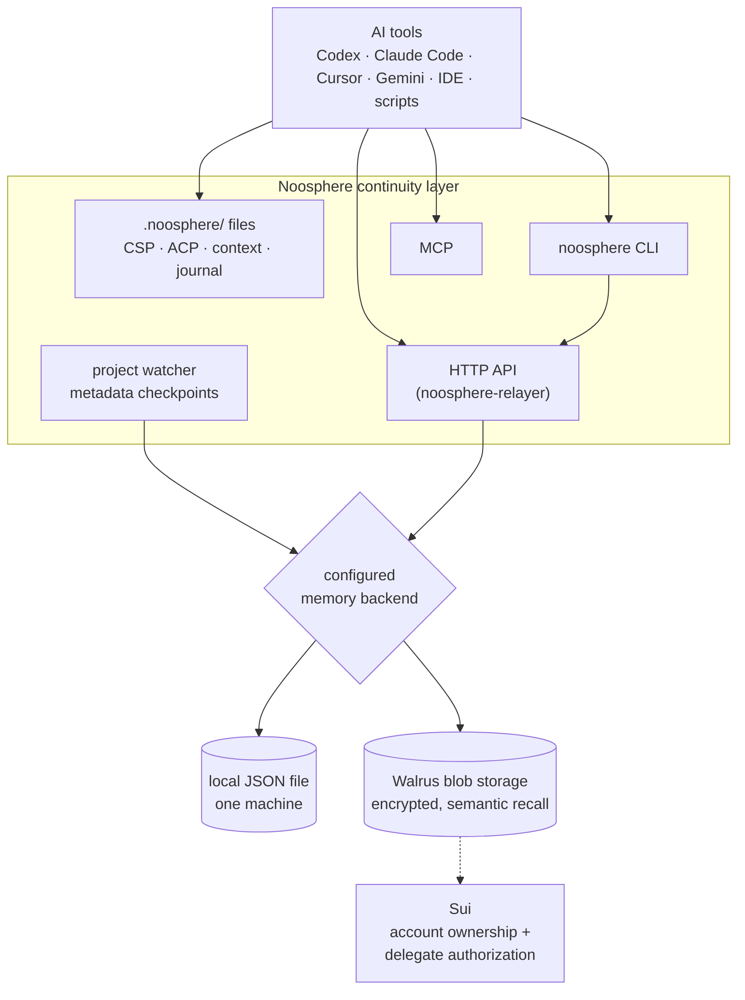
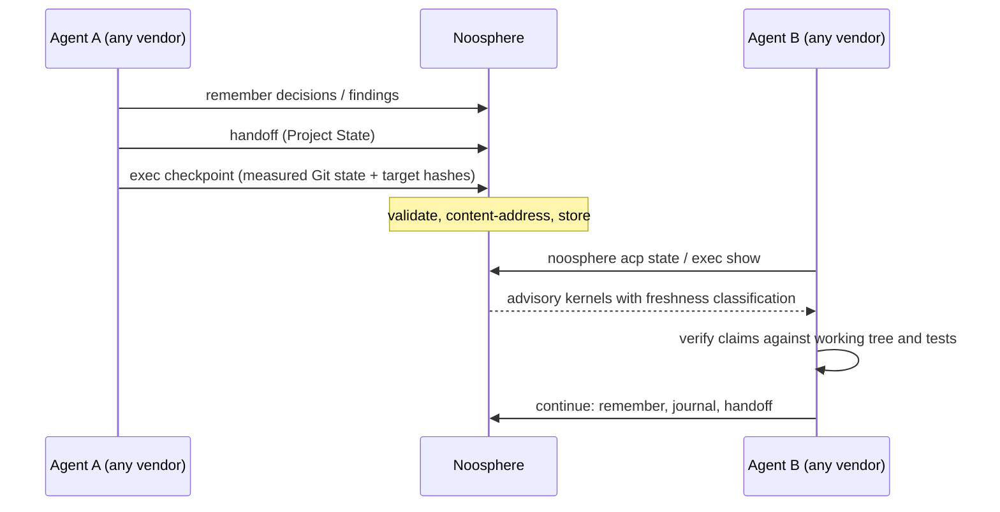

# Noosphere

**Open-source continuity infrastructure for resumable AI workflows.**

[](https://www.npmjs.com/package/noosphere-continuity)
[](https://www.npmjs.com/package/noosphere-relayer)
[](https://github.com/papmilan/noosphere/actions/workflows/ci.yml)
[](LICENSE)
[](noosphere-mcp/package.json)

Noosphere is an open-source continuity layer for AI-assisted software work.
It records project intent, decisions, evidence, handoffs, and execution
state so work can pause, resume, and move between agents without forcing the
next session to reconstruct the project from scratch. Its Continuation State
Protocol (CSP) keeps durable project context close to the repository, while
the Agent Continuity Protocol (ACP) provides validated, Git-aware handoffs.

## Why use Noosphere?

AI work is often trapped in a single chat, session, or vendor. Noosphere
keeps the continuity in the project instead: the next agent can start from
shared facts, verify prior work, and continue a resumable workflow across
Codex, Claude Code, Cursor, local models, scripts, or custom clients.

## Install

Requirements: Node.js 22+, npm, and Git. No Walrus account is needed for
local mode.

```sh
git clone https://github.com/papmilan/noosphere.git
cd noosphere
npm --prefix noosphere-mcp run install:user
~/.noosphere/bin/noosphere setup
```

The installer adds the `noosphere` command, per-user background services,
and shell activation hooks for macOS, Linux, and Windows.

## Main capabilities

- **CSP project continuity:** preserves durable context, pinned intent,
  decisions, evidence, and handoffs alongside the repository.
- **ACP handoffs:** stores validated project state and execution checkpoints
  so another agent can resume from what is true and what remains to do.
- **Cross-agent workflows:** shares continuity through project files, the
  CLI, HTTP API, and MCP rather than tying it to one AI vendor.
- **Local or remote memory:** supports local-file workflows and optional
  shared remote memory with semantic recall.

## Quick start

### Try it in five minutes (local, no credentials)

```sh
git clone https://github.com/papmilan/noosphere.git
cd noosphere

# Start the memory relay in local-file mode
cd noosphere-relayer
npm install
npm run demo
```

On Windows, `npm run demo` sets the environment variable POSIX-style; use
the direct form instead:

```powershell
$env:NOOSPHERE_MEMORY_BACKEND = 'local-file'; node index.js   # PowerShell
```

```bat
set NOOSPHERE_MEMORY_BACKEND=local-file&& node index.js       # cmd.exe
```

In a second terminal, store and recall a memory over HTTP:

```sh
curl http://127.0.0.1:3001/health

curl -X POST http://127.0.0.1:3001/v1/actions \
  -H "Content-Type: application/json" \
  -H "Idempotency-Key: demo-1" \
  -d '{"project_id":"demo","agent_id":"codex","action_type":"decision",
       "content":"Use idempotency keys for payment creation."}'

# Writes flow through a durable queue; allow up to ~30 seconds
curl -X POST http://127.0.0.1:3001/v1/projects/demo/recall \
  -H "Content-Type: application/json" \
  -d '{"query":"what affects duplicate payments?","limit":5}'
```

Local-file mode keeps memory in a gitignored JSON file on this machine. It
demonstrates the full flow but does not provide cross-machine memory.

### Register a project and make the first handoff

```sh
cd /path/to/your/repository
noosphere register --path "$PWD"   # or just enter it from an integrated shell

noosphere context                  # read current shared context
noosphere remember --agent me --type decision "Ship v2 with the new queue."
noosphere state                    # CSP: current task, blocker, next action
noosphere acp state                # ACP: rich continuity kernel
noosphere exec show                # ACP checkpoint: what was I about to do
```

Hand the project to the next agent (any vendor, any machine):

```sh
cat handoff.json | noosphere handoff --stdin
noosphere exec checkpoint --file checkpoint.json
```

Envelope formats and validation rules live in [docs/ACP.md](docs/ACP.md).

### Connect Walrus Memory (optional, for shared remote memory)

```sh
cp noosphere-relayer/env.example noosphere-relayer/.env
```

Create credentials in the
[Walrus Memory dashboard](https://memory.walrus.xyz/), then set:

```dotenv
MEMWAL_NETWORK=mainnet
MEMWAL_ACCOUNT_ID=0x...
MEMWAL_PRIVATE_KEY=...
NOOSPHERE_MEMORY_BACKEND=walrus-memory
DEMO_MODE=false
```

The `0x` prefix belongs on the account ID; the delegate private key is a
64-character hexadecimal Ed25519 key. Noosphere validates that the account
exists on the selected Sui network, is active, and has the delegate public
key registered.

## Architecture



- **Walrus** stores the encrypted memory blobs; Walrus Memory adds semantic
  indexing so an agent can ask for the history relevant to the current task
  instead of loading every record.
- **Sui** provides account ownership and delegate authorization. No project
  memory text is stored on Sui, and Noosphere requires no custom smart
  contract.
- **Noosphere** provides the project-level behavior: stable project
  namespaces, portable records, Git-aware automatic checkpoints,
  prompt-ready context files, a durable upload queue with restart recovery,
  and local project lifecycle management.

## Core concepts

### Project memory

Two complementary kinds of memory:

- **Automatic workspace checkpoints.** After the working tree settles, the
  watcher records changed paths, branch and commit, diff statistics, a
  workspace fingerprint, and project identity. Metadata only — raw source
  diffs are not uploaded by default.
- **Explicit memories.** Agents and developers store decisions, findings,
  failed approaches, test results, and handoffs when they matter:

```sh
noosphere remember --agent codex --type decision \
  "Use exponential backoff for retryable API failures."
```

Automatic checkpoints preserve observable workspace state. Explicit
memories preserve intent and conclusions that cannot be inferred from files
alone.

### Continuation State Protocol (CSP)

CSP is the small, Git-tracked machine state at `.noosphere/state.json`. It
contains only durable task truth: version, status, current task, next action,
and blocker. Observed branch/HEAD, agent identity, timestamps, revision, and
watcher telemetry stay in ignored `.noosphere/runtime-state.json`. It is a
validated snapshot—not an event log—and never infers completion from Git,
npm, CI, or journal prose.

```sh
noosphere state
noosphere state set status in-progress
noosphere state set current-task "Prepare the patch release"
noosphere state next "Run the complete suite"
noosphere state set blocker "Waiting for maintainer approval"
noosphere state reopen             # explicit done -> in-progress intent
noosphere state restore            # explicit archived -> in-progress intent
```

Concurrent transitions compare the exact tracked-file identity immediately
before writing. Unambiguous changes merge recursively; conflicting scalar
edits are reported without writing. Resume, checkpoint, journal, branch, and
agent changes refresh only ignored runtime observations. The normative schema,
state machine, migration, and compatibility rules are in [CSP.md](CSP.md).

### Agent handoff (ACP)

The Agent Cognitive-state Protocol (ACP) hands a project between agents
through two small validated files:

- **Project State** (`acp.project-state/1`) answers *what is true*:
  objective, decisions, evidence, blockers, next actions. Print with
  `noosphere acp state`; hand off with `noosphere handoff`.
- **Execution checkpoint** (`acp.execution-state/1`) answers *what was I
  about to do*: current step, target file, remaining plan. Record with
  `noosphere exec checkpoint`; resume with `noosphere exec show`.

Both are advisory and honest by construction: the CLI measures repository
state and file hashes itself, so a checkpoint cannot claim tests pass and
cannot smuggle code or prompts to the next agent (fenced code and diff
syntax are rejected at validation).



`noosphere acp state sync` extends the same state across machines with
confirmation-gated apply and quarantine for invalid bytes. Full protocol
semantics: [docs/ACP.md](docs/ACP.md).

### Master prompts survive tool switches

When a substantial prompt defines multiple phases, Noosphere pins the exact
prompt in `.noosphere/master-prompt.md`, and appends every later visible
user prompt to `.noosphere/followups.jsonl`. A later instruction such as
"continue with phase 2" is resolved against the original phase definitions,
not inferred from a summary. Claude Code and Codex capture qualifying
prompts automatically through installed hooks; any other agent can pin
intent explicitly:

```sh
cat project-plan.md | noosphere master-prompt
cat updated-plan.md | noosphere master-prompt --replace   # only when intent truly changes
```

Agents separate *intent* from *completion evidence*: current files, Git
state, and tests are ground truth; the journal carries explicit findings;
checkpoints and semantic recall show earlier activity. Agents are
instructed to verify completion claims against the working tree before
continuing.

## Why it works with any agent

No proprietary plugin is required. The same memory is available through
multiple open interfaces:

| Interface | Best for |
| --- | --- |
| `.noosphere/context.md` | Any agent that can read project files |
| `.noosphere/journal.md` | Human-readable local notes and handoffs |
| `noosphere` CLI | Terminal agents and scripts |
| HTTP API | IDEs, web apps, agent frameworks, custom clients |
| MCP | Agents that support the Model Context Protocol |

Tool-specific files are optional adapters — add only the ones you use:

```sh
noosphere adapters --only claude
noosphere adapters --only claude,codex,mcp
```

They point compatible tools back at the same `.noosphere/` folder; no
per-vendor memories are created.

### Local models through Ollama

Every model served by Ollama's local API can join the same project memory:

```sh
noosphere ollama qwen3-coder                                   # interactive
noosphere ollama run minimax-m2 "Continue phase 2"             # one prompt
noosphere ollama llama3.2 --no-store                           # private session
```

Noosphere refreshes shared memory before the first response, injects it as
a system message, and stores a concise handoff when the session ends. The
Ollama `thinking` field is never added to shared memory, and local-model
transcripts are marked unverified.

## Everyday workflow

```sh
noosphere context                                  # start: read shared context
noosphere recall "What remains broken in auth?"    # or ask a specific question

noosphere remember --agent codex --type decision "…"   # store what matters
noosphere journal --agent cursor "Verified the cache fix; timeouts remain."

noosphere state                                    # current CSP project truth
noosphere acp state                                # rich ACP project state
noosphere exec checkpoint --file checkpoint.json   # where work stood
```

### CLI reference

```text
noosphere setup | doctor | uninstall
noosphere credentials status | migrate | rotate
noosphere activate | deactivate
noosphere register --path /absolute/repository
noosphere projects | status | protocol
noosphere baseline | checkpoint | refresh | restore
noosphere context
noosphere recall "query"
noosphere remember --agent <name> --type <type> "content"
noosphere journal --agent <name> "note"
noosphere master-prompt [--replace]
noosphere state [show|set|next|reopen|restore] [--json]
noosphere acp state [--json] [validate|sync|push|pull|history|quarantine]
noosphere handoff --stdin | --file <handoff.json>
noosphere exec checkpoint|show|import-plan|clear
noosphere ollama <model> [run "prompt"] [--no-store]
noosphere adapters --only <list>
```

## HTTP API

Store a memory:

```http
POST /v1/actions
Content-Type: application/json
Idempotency-Key: <unique-action-id>

{
  "project_id": "payments-api",
  "agent_id": "codex",
  "action_type": "decision",
  "content": "Use idempotency keys for payment creation.",
  "metadata": { "files": ["src/payments.js"] }
}
```

A successful response includes the backend's memory identifier and project
namespace. If the backend is temporarily unavailable, the API returns an
accepted-and-queued response and retries from durable local state.

Recall and context:

```http
POST /v1/projects/payments-api/recall
GET  /v1/projects/payments-api/context?q=duplicate%20payments&format=text
GET  /v1/projects/payments-api/bootstrap
```

Discovery: `GET /.well-known/noosphere.json`, `GET /openapi.json`,
`GET /health`, `GET /ready`. The OpenAPI document describes the full
surface.

## MCP

`noosphere adapters --only mcp` generates project MCP configuration for the
official Walrus Memory server:

```sh
npx -y @mysten-incubation/memwal-mcp@0.0.4 --staging --namespace noosphere-<project>
```

MCP is one access method, not the core protocol; agents without MCP use the
same memory through files, CLI, or HTTP. Note: the pinned `memwal-mcp`
release currently targets the staging Walrus Memory service, so the MCP
adapter reads a different backend than a mainnet-configured relayer. Prefer
files, CLI, or HTTP when exact parity with your configured backend matters.

## Using Noosphere on an existing project

Noosphere does not require a new repository:

```sh
cd /path/to/existing-project
noosphere activate
```

On first activation every Git repository receives one bounded baseline:
repository age and commit count, current branch and HEAD, tracked-file
counts by top-level directory, and up to 50 recent commit subjects (capped
at 200, configurable in `.noosphere/config.json`; disable with
`onboarding.auto_baseline: false` if commit subjects are sensitive). The
watcher then records changes made *after* onboarding instead of pretending
the historical repository appeared in one session.

Git cannot reconstruct old AI chats or verbal decisions. Add the important
missing knowledge explicitly:

```sh
noosphere remember --agent maintainer --type decision \
  "Production uses PostgreSQL. SQLite is only for local development."
cat existing-roadmap.md | noosphere master-prompt
```

### Restore on a fresh machine

After cloning to a machine where `.noosphere/` is missing:

```sh
noosphere restore
```

This reconstructs `baseline.md`, `master-prompt.md`, `followups.jsonl`, and
`context.md` from the project's Walrus records. Files are restored only
when missing or empty; existing local content is never overwritten, and the
command is safe to repeat. It requires the same `project_id` in
`.noosphere/config.json`, provisioned credentials, and network access. The
local journal does not survive the move unless `privacy.share_journal` was
enabled on the previous machine.

## Project files

```text
.noosphere/
├── baseline.md       Optional established-project onboarding snapshot
├── config.json       Project identity, privacy, and adapter settings
├── context.md        Refreshed context for file-reading agents
├── journal.md        Local public work notes and handoffs
├── state.json        Git-tracked canonical CSP project state
├── runtime-state.json Ignored runtime observations and watcher telemetry
├── protocol.json     Machine-readable continuity protocol
└── instructions.md   Human-readable universal instructions
```

`CLAUDE.md`, `AGENTS.md`, `GEMINI.md`, `.cursor/`, and `.mcp.json` exist
only after an explicit `noosphere adapters` command. (This repository
tracks its own copies because Noosphere develops itself with Noosphere.)

## Privacy model

- **Checkpoints are metadata-only by default.** Raw source diffs upload
  only when `privacy.include_diff` is explicitly enabled. The baseline is
  metadata-only too.
- **The managed relayer sees plaintext.** Walrus Memory's managed relayer
  receives plaintext to create embeddings and apply Seal encryption before
  storing encrypted blobs on Walrus. This is a documented trust boundary,
  not zero-knowledge encryption.
- **Pending uploads** live in an owner-only durable queue until confirmed,
  then are removed.
- **Credentials** are stored through the platform credential backend;
  Linux systems without Secret Service fall back to an owner-only `0600`
  file. Private keys are never printed.
- **No hidden reasoning.** Noosphere never asks agents to reveal
  chain-of-thought; memories are concise conclusions, evidence, and
  handoffs.

Full data path and retention: [docs/PRIVACY.md](docs/PRIVACY.md) and
[noosphere-relayer/MEMORY_SECURITY.md](noosphere-relayer/MEMORY_SECURITY.md).

## Reliability

- Writes enter an atomic durable queue before upload; queued writes resume
  after restart, and idempotency receipts survive restarts.
- Temporary failures use exponential backoff and respect upstream cooldown
  hints; uploads are serialized to avoid request storms.
- Explicit user memories are prioritized before background checkpoints.
- Readiness (`/ready`) exposes pending jobs and the next upload slot.
- The default service binds to `127.0.0.1`. Production and non-loopback
  startup **fail closed** without `NOOSPHERE_API_TOKEN`; public deployments
  require bearer authentication and explicit CORS origins. See
  [docs/DEPLOYMENT.md](docs/DEPLOYMENT.md).

## Important limitations

- Semantic recall returns relevant memories, not a guaranteed complete
  chronological audit log.
- Automatic checkpoints preserve observable Git state, not every unspoken
  decision made inside an agent session.
- Onboarding cannot reconstruct old chats or undocumented decisions.
- Forgetting a project removes local registration but does not delete its
  existing Walrus memories; retention follows Walrus Memory account
  behavior.
- The managed relayer is part of the plaintext trust boundary.
- Demo mode is local-only and is not Walrus-backed shared memory.

## Repository structure

```text
noosphere-mcp/             npm: noosphere-continuity
  continuity/              CLI, watcher, CSP, context refresh, ACP state
  lifecycle/               Installer, services, registry, credentials
  hooks/                   Optional tool-specific hooks
  mcp-server/              MCP configuration assets

noosphere-relayer/         npm: noosphere-relayer
  index.js                 HTTP API and setup endpoints
  memory.js                Portable record serialization
  walrus-memory.js         Walrus Memory and Sui account adapter
  durable-store.js         Restart-safe queue and receipts
  security.js              Authentication, CORS, headers, rate limits
  vendor/acp-protocol/     Docker-context mirror of the protocol package

noosphere-acp-protocol/    Shared ACP package: envelopes, schemas, validation

docs/
  ACP.md                   Agent handoff protocol reference
  PRIVACY.md               Data handling and retention
  DEPLOYMENT.md            Public deployment and recovery
  adr/                     Architecture decision records
  design/                  Full ACP design documents and plans
```

## Development

```sh
npm --prefix noosphere-relayer install && npm --prefix noosphere-relayer run check
npm --prefix noosphere-mcp install     && npm --prefix noosphere-mcp run check
npm --prefix noosphere-acp-protocol test
```

Live Walrus verification is intentionally separate:
`npm --prefix noosphere-relayer run test:live`.

Contributions welcome — read [CONTRIBUTING.md](CONTRIBUTING.md) for setup,
standards, and the review process. Security reports go through
[SECURITY.md](SECURITY.md), releases are recorded in
[CHANGELOG.md](CHANGELOG.md), and design history lives in
[docs/adr/](docs/adr/) and [docs/design/](docs/design/).

## Status and roadmap

Noosphere is a released, open-source project for durable AI workflow
continuity. It is verified with live Walrus mainnet store and recall,
process restart and durable queue recovery, cross-agent CLI handoffs, and
multi-project lifecycle management across macOS, Linux, and Windows.

Current focus is stability, portability, and documentation while hardening
the existing CSP and ACP surface. Feature proposals are welcome as GitHub
issues.

## FAQ

**Is my source code uploaded?**
Not by default. Automatic checkpoints are metadata-only (paths, branch,
diff statistics). Raw diffs upload only if you explicitly enable
`privacy.include_diff`.

**Do I need a Walrus account or any blockchain knowledge?**
No. Local-file mode runs the entire flow on one machine with zero
credentials. Walrus Memory adds encrypted cross-machine storage and
semantic recall; Sui is only used for account ownership and delegate
authorization underneath Walrus Memory.

**Is this an MCP server?**
No. MCP is one of four interfaces (files, CLI, HTTP, MCP). Agents without
MCP support lose nothing.

**How is this different from a memory plugin for one tool?**
Memory attaches to the project, not the vendor. Any tool that can read a
file, run a command, or make an HTTP request participates — including local
Ollama models.

**Can an agent smuggle instructions or code through a handoff?**
ACP execution checkpoints structurally reject fenced code, diff syntax, and
multi-line prose, and the CLI measures Git state and file hashes itself, so
asserted claims ("tests pass") are overwritten by measurement. Kernels are
rendered as advisory statements, never imperatives.

**Why does recall return nothing right after storing?**
Writes flow through the durable queue and become recallable after the next
upload cycle — up to ~30 seconds in local-file mode.

**What happens when Walrus is unreachable?**
The write is accepted into the durable queue and retried with backoff;
queued writes survive restarts.

## Troubleshooting

- **`noosphere: command not found`** — the installer puts the binary in
  `~/.noosphere/bin`; restart the shell or check that the activation hook
  was added, then run `noosphere doctor`.
- **`noosphere credentials status` fails** — verify the account in the
  [Walrus Memory dashboard](https://memory.walrus.xyz/), that
  `MEMWAL_NETWORK` matches where the account exists, and that the delegate
  key is registered.
- **Relayer refuses to start in production** — that is the fail-closed
  token check: set `NOOSPHERE_API_TOKEN` (generate with
  `openssl rand -hex 32`) or run loopback-only.
- **Port 3001 already in use** — set `PORT` and point
  `NOOSPHERE_RELAYER_URL` (or `relayer_url` in `.noosphere/config.json`)
  at the same address.
- **Windows: scheduled task creation blocked** — the installer degrades
  gracefully when `schtasks /Create` is blocked; per-user services still
  work. Credential encryption under PowerShell 5.1 requires
  `noosphere-continuity` ≥ 2.1.6 and `noosphere-relayer` ≥ 2.0.4.
- Anything else: `noosphere doctor`, then open an issue with its output.

## License

[MIT](LICENSE) © 2026 Milan Pap
