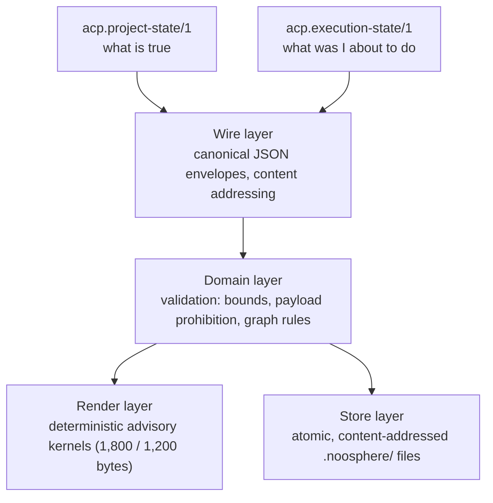
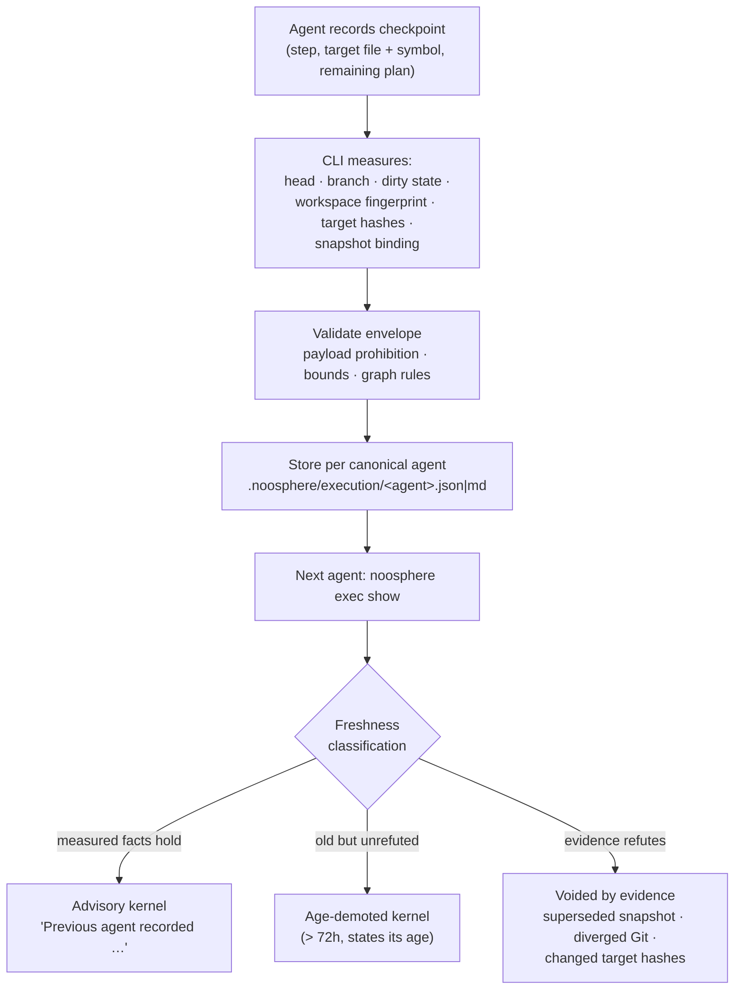

# Agent Cognitive-state Protocol (ACP)

ACP is Noosphere's vendor-neutral protocol for handing a software project
between AI agents. It is local-first and storage-neutral, layered on top of
the memory and journal systems, and stores only externally shareable state —
never hidden reasoning, secrets, or raw chat.

This document is the protocol reference for implementers and contributors.
For installation and everyday usage, read the [main README](../README.md).

## The ACP stack

Both object types share one wire/domain/render/store stack:



## Object types

ACP defines two object types. Both are canonical JSON envelopes with content
addressing, validated by the shared protocol package
[`noosphere-acp-protocol/`](../noosphere-acp-protocol/).

### `acp.project-state/1` — what is true

The Project State envelope carries objective, decisions, evidence,
assumptions, conflicts, blockers, risks, and next actions.

- `.noosphere/continuity.json` is the canonical, content-addressed envelope.
- `.noosphere/continuity.md` is a derived kernel of at most 1,800 bytes that
  a fresh agent reads first.
- A handoff never overwrites conflicting work: a stale update appends new
  distinct assertions, and every competing edit becomes an explicit
  unresolved conflict.
- When mandatory conflicts or blockers would exceed the kernel budget, the
  kernel refuses to summarize and points to `noosphere acp state --json` instead.

CLI surface:

```bash
noosphere acp state              # print the compact continuity kernel
noosphere acp state --json       # print the canonical ACP envelope
noosphere acp state validate     # verify the persisted envelope and kernel
cat handoff.json | noosphere handoff --stdin
noosphere handoff --file handoff.json
```

### `acp.execution-state/1` — what was I about to do

An execution checkpoint is a short-lived advisory cursor over one Project
State snapshot: current step, target file and symbol, remaining steps, and
search frontier.

- **Measured versus asserted.** The CLI itself measures every fact a
  successor will trust: repository head, branch, dirty state, workspace
  fingerprint, per-step target file hashes, and the snapshot binding.
  Asserted lies are overwritten by measurement; an agent cannot claim tests
  pass.
- **Payload prohibition (structural).** Checkpoints carry locations and
  goals only. Fenced code, diff/patch syntax, and multi-line prose are
  rejected at validation (`payload-forbidden`).
- **Evidence voids, age demotes.** Only measured evidence — a superseded
  snapshot, diverged Git, changed target hashes — can void a checkpoint.
  Age demotes past the 72-hour policy boundary and retention is 30 days;
  neither value is accepted from checkpoint input. A `created_at`
  implausibly ahead of the observed clock is rejected
  (`future-created-at`).
- **Honest target classification.** On resume each target is classified as
  `target-unchanged`, `target-changed`, `target-missing`, or `unknown`.
  `target-unchanged` only proves the target bytes match: assumptions and
  dependencies still require validation, so no step is automatically
  actionable. `depends_on_files` is deferred rather than inferred unsafely
  in v1.
- **Per-agent isolation and contention.** Checkpoints live per canonical
  agent in `.noosphere/execution/<agent>.json|md`. Overlapping live targets
  render a visible `CONTENTION` warning. The advisory kernel is at most
  1,200 bytes, deterministic, framed as "Previous agent recorded …" (never
  imperatives), and newline-injection sanitized.
- Local rebased salvage follows only the directly retained validated
  parent, so it is deliberately conservative and limited.



CLI surface:

```bash
noosphere exec checkpoint --file checkpoint.json   # record where work stood
noosphere exec show                                # validated advisory kernel
noosphere exec import-plan docs/plan.md            # adopt a checkbox plan
noosphere exec clear --current
```

`exec clear` requires `--current`, `--agent`, or `--all --confirm-all`.

## Exact state across machines

`noosphere acp state sync|push|pull|history|quarantine --json` uses deterministic
ACP envelopes.

```mermaid
sequenceDiagram
    participant C as CLI (machine B)
    participant R as Relayer (durable index)
    participant W as Walrus (blob bytes)

    C->>R: discover (read-only)
    R-->>C: heads, snapshot ancestry, capabilities
    C->>C: cache single-use confirmation_id (expires ≤ 5 min)
    C->>R: apply --confirm-remote <confirmation_id>
    R->>W: fetch exact snapshot bytes
    W-->>R: content-addressed envelope
    R-->>C: validated envelope
    alt bytes valid and ancestry intact
        C->>C: apply to local ACP state
    else invalid, foreign, or expired
        C->>C: reject; owner-only quarantine
    end
```

- Discovery is read-only; apply requires a cached single-use
  `--confirm-remote <confirmation_id>`. Confirmations expire within five
  minutes and bind the snapshot, repository observation, heads, relayer
  index, versions, action, and override. A snapshot ID is not a
  confirmation.
- Advanced history requires `--allow-stale-advanced` at both discovery and
  apply, and renders with downgraded authority and suppressed
  repository-dependent next actions.
- Set `NOOSPHERE_ACP_SYNC=false` to disable exact remote synchronization.

Handoffs remain locally authoritative: configured projects reserve the exact
envelope in owner-only retry metadata before committing local state, and a
full 200-entry queue fails without changing local state. Network failures
retain that envelope for retry. Invalid, foreign, or expired bytes are never
applied and may be placed in owner-only quarantine for explicit operator
inspection or deletion.

Cross-machine exact synchronization requires every client to use the same
durable relayer index. Sharing Walrus credentials alone is not sufficient.
"walrus-backed/relayer-indexed" means Walrus replicates bytes while exact
lookup and heads still depend on that relayer index. Capabilities distinguish
local-only, shared-relayer, and walrus-backed/relayer-indexed deployments.

## Implementation layout

```text
noosphere-acp-protocol/    Shared protocol package: envelopes, schemas,
                           validation, head sets (source of truth)
noosphere-mcp/continuity/acp/
                           CLI-side state, freshness, render, store, sync
noosphere-relayer/vendor/acp-protocol/
                           Docker-context mirror of the protocol package;
                           parity with the source is enforced by
                           noosphere-mcp/tests/distribution.test.js
```

## Design documents

The full designs, including the hostile reviews that shaped them:

- [ACP continuity kernel](design/specs/2026-07-12-acp-continuity-kernel-design.md)
- [ACP remote exact-state sync](design/specs/2026-07-12-acp-remote-exact-state-sync-design.md)
- [ACP execution continuity](design/specs/2026-07-13-acp-execution-continuity-design.md)
