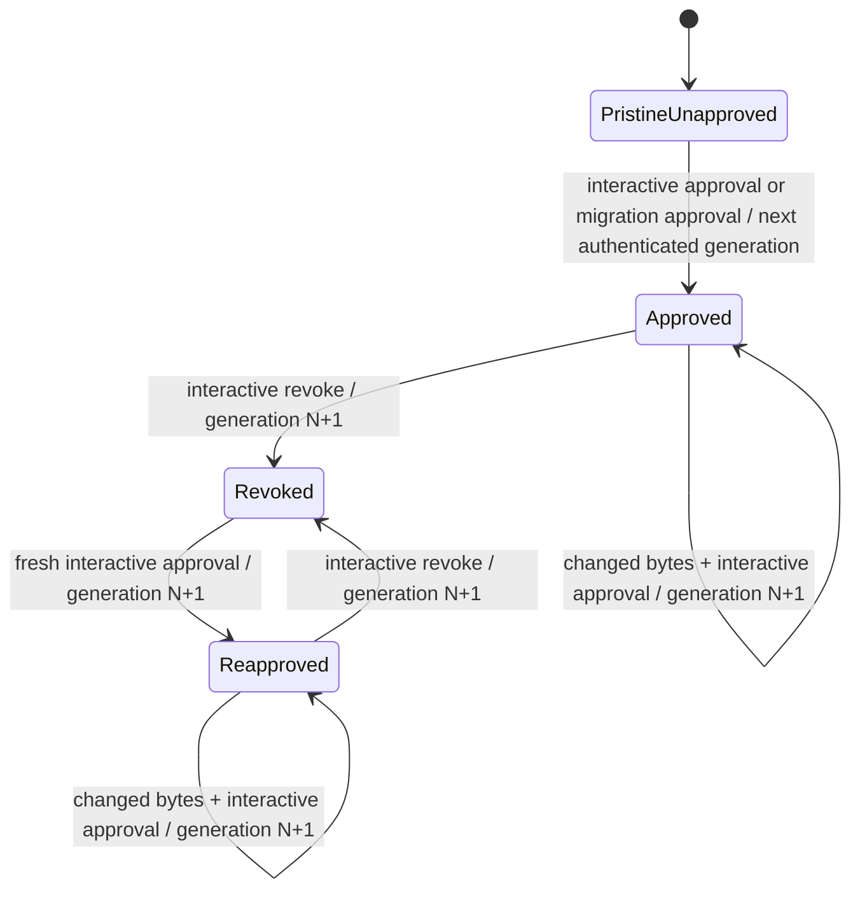
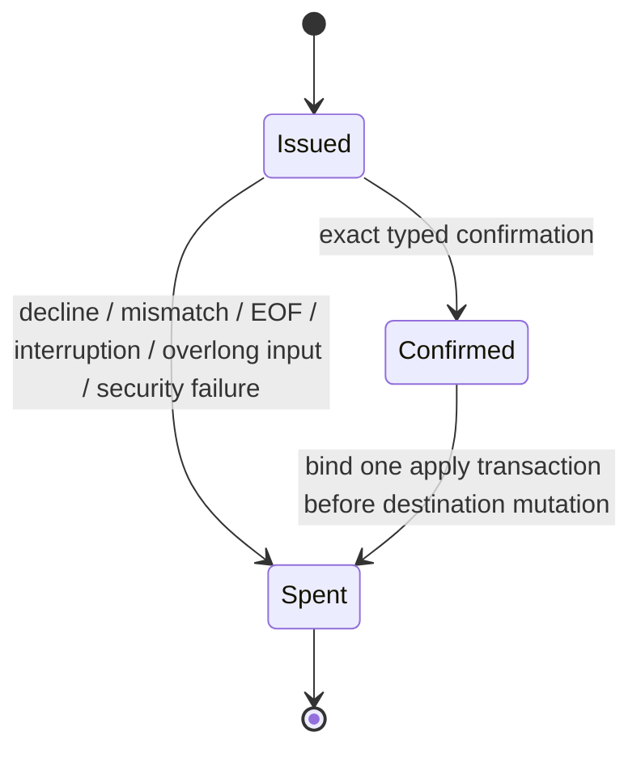
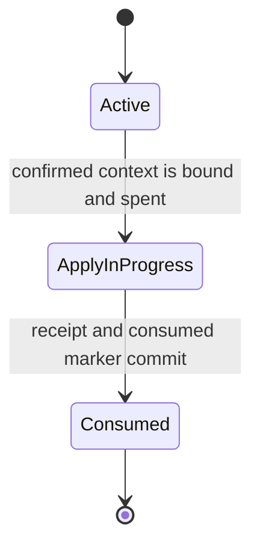
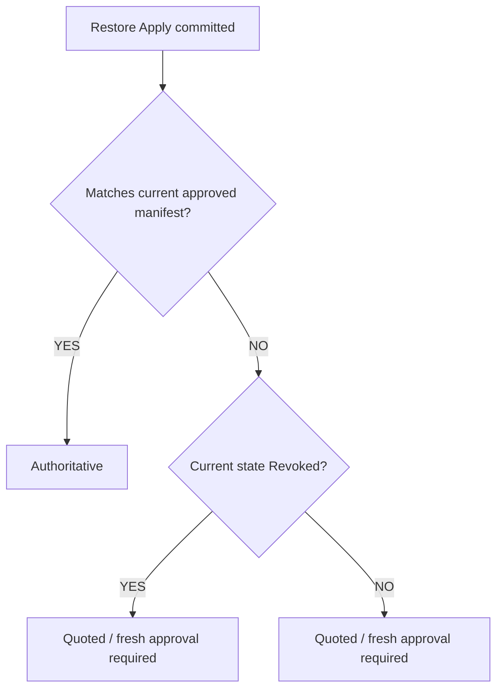

# SEC-05 Phase 4C — Authority Retirement, Revocation, and Restore

Status: complete security specification for user review; implementation has not
started.

Base: `d2992c3` (`origin/main` when this specification was written).

## 1. Scope

Phase 4C SHALL:

1. permanently retire format-1 authority;
2. make revocation a first-class authenticated format-2 generation;
3. require fresh per-slot interactive approval during legacy migration;
4. stage recalled content outside the project and outside the trust store;
5. define the only supported operation that may apply a staged restore candidate
   to a source slot; and
6. preserve one append-only authenticated format-2 state machine for approval,
   migration approval, revocation, and reapproval.

Phase 4C SHALL NOT create a second authority database.

This specification covers the format-2 authority slots `master-prompt`,
`instructions`, and `baseline`. A legacy record for any other slot, including
`followups`, SHALL be reported by migration as unsupported and SHALL remain
non-authoritative.

Phase 4C restore apply SHALL support only `master-prompt`, `instructions`, and
`baseline`. It MUST NOT apply a generic artifact, accept an arbitrary
destination, accept a repository-relative destination, or derive a destination
from remote or candidate metadata. Other artifacts MAY exist in the owner-local
staging store and MAY be listed or shown as untrusted observations, but Phase 4C
MUST NOT apply them to the project tree.

Owner-selected logical project labels, summary provenance, replay/freshness for
semantic retrieval, OS-mediated human-presence proof, and the Phase 4B review
carryovers concerning BOM display, duplicated lock readers, unusable journal
upload, and large approval views are deferred. They SHALL NOT be introduced
incidentally by Phase 4C.

## 2. Normative language

The key words **MUST**, **MUST NOT**, **SHALL**, **SHALL NOT**, **SHOULD**, and
**MAY** are normative.

“Fail closed” means the operation returns no authority, performs no project-file
replacement, performs no fallback to legacy trust, and emits a bounded
diagnostic that contains no untrusted file bytes.

## 3. Trust boundaries

Phase 4C has four distinct domains:

| Domain | Contents | Security meaning |
| --- | --- | --- |
| Project tree | Source slots and other project files | Repository-controlled; never authenticates trust |
| Format-2 trust store | Binding, manifest, immutable generations, audit events, transaction journals, locks | Owner-only authority state |
| Restore staging store | Candidate payloads, candidate envelopes, apply journals, consumption receipts | Owner-only transport state; never authority |
| Remote memory | Recalled payloads and remote metadata | Untrusted input |

The format-2 trust store and restore staging store MUST have disjoint roots and
disjoint authenticated record types. A valid restore-stage MAC MUST NOT verify
as a trust-record MAC, manifest MAC, audit-event MAC, binding MAC, or transaction
journal MAC.

Owner-only placement authenticates who may mutate local state; it does not make
recalled content authoritative. A staged candidate MUST retain
`origin=remote-recall` and `trust=untrusted` semantics regardless of its local
permissions or MAC.

### 3.1 Cryptographic domain separation

Every authenticated record MUST include one exact `domain` string. The MAC
construction SHALL be:

```text
HMAC-SHA-256(
  machine-key,
  canonical-json([domain, record-without-mac])
)
```

The two-element array above is the canonical MAC input. The domain tag is its
first element. `record-without-mac.domain` MUST equal that first element.
Canonical JSON, strict schema validation, fatal UTF-8 decoding, duplicate-key
rejection, unknown-field rejection, and exact canonical-byte comparison SHALL
apply before MAC verification.

The exact domain tags SHALL be:

| Record type | Domain tag |
| --- | --- |
| Project binding | `noosphere/sec05/v2/project-binding` |
| Approved generation | `noosphere/sec05/v2/generation/approved` |
| Revoked generation | `noosphere/sec05/v2/generation/revoked` |
| Authority manifest | `noosphere/sec05/v2/authority-manifest` |
| Authority audit event | `noosphere/sec05/v2/authority-audit-event` |
| Authority transaction journal | `noosphere/sec05/v2/authority-transaction-journal` |
| Authority slot lock | `noosphere/sec05/v2/authority-slot-lock` |
| Restore candidate envelope | `noosphere/sec05/v2/restore-candidate-envelope` |
| Restore confirmation context | `noosphere/sec05/v2/restore-confirmation-context` |
| Restore apply journal | `noosphere/sec05/v2/restore-apply-journal` |
| Restore consumption receipt | `noosphere/sec05/v2/restore-consumption-receipt` |
| Restore consumed-candidate marker | `noosphere/sec05/v2/restore-consumed-candidate-marker` |

A parser MUST supply the expected domain independently of the input record and
MUST reject a different stored domain. A valid MAC from one domain MUST never
verify in another domain, even when every remaining field is byte-identical.
No command, environment value, config value, remote field, or caller parameter
may select or weaken the expected domain.

### 3.2 Canonical project identity object

Approval, migration approval, revocation, reapproval, restore staging,
confirmation, apply, and recovery MUST use one canonical project identity
object. It SHALL contain exactly these fields:

```json
{
  "bindingIdentifier": "sha256:<64 lowercase hexadecimal characters>",
  "canonicalFilesystemIdentity": "sha256:<64 lowercase hexadecimal characters>",
  "identitySchema": "noosphere.sec05.project-identity",
  "identityVersion": 1,
  "machineKeyIdentity": "<64 lowercase hexadecimal characters>",
  "ownerScope": "<exact authenticated owner-scope string>",
  "projectIdentity": "<canonical lowercase UUID v4>"
}
```

`bindingIdentifier` SHALL be SHA-256 of the exact canonical authenticated
project-binding record bytes, including its MAC, encoded as `sha256:<hex>`.

`canonicalFilesystemIdentity` SHALL be SHA-256 of the UTF-8 bytes returned by
the platform’s canonical realpath operation for the project root, encoded as
`sha256:<hex>`. The realpath string MUST NOT be Unicode-normalized,
case-folded, separator-rewritten, or trimmed. The digest MUST equal the
authenticated binding’s `realpathHash`. A missing project path, unsupported
realpath result, invalid encoding, changed path identity, or digest mismatch
MUST fail closed.

`projectIdentity`, `ownerScope`, and `machineKeyIdentity` SHALL equal the
authenticated format-2 binding’s project UUID, owner scope, and machine-key ID.

The canonical project identity digest SHALL be:

```text
sha256:<SHA-256(canonical-json(project-identity-object))>
```

Every security record and confirmation listed above MUST bind that digest.
No operation may use a display path, candidate metadata, remote identifier,
binding-path filename, independently reconstructed subset, or non-canonical
serialization as project identity. A mismatch between any two identity
representations MUST fail closed.

## 4. Security invariants

### 4.1 Irreversible format-1 retirement

Loading and executing the Phase 4C authority dispatcher is the retirement
cutover event. Running, completing, interrupting, or declining migration is not
the cutover event.

1. A Phase 4C authority decision MUST NOT consult format-1 records.
2. Format-1 MUST be non-authoritative before, during, and after migration.
3. No binding absence, manifest absence, manifest deletion, record deletion,
   corruption, read failure, recovery outcome, unsupported schema, or exception
   MAY select format-1 authority.
4. Removing all format-2 state MUST result in no authority.
5. Migration MAY read format-1 state only to inventory legacy slots and explain
   migration eligibility. That read MUST NOT participate in the authority
   decision.
6. Legacy retirement MUST NOT depend on a deletable per-project marker,
   environment value, config value, timestamp, or successful migration command.
7. Reinstall, restart, downgrade-resistant recovery within the Phase 4C binary,
   and partial migration MUST preserve the rule that format-1 is ignored.
8. Format-1 MUST already be disabled before the first migration inventory,
   prompt, binding read for mutation, or state mutation occurs.

Format-1 files MAY remain on disk for diagnosis or later explicit archival.
Their presence is inert.

### 4.2 Append-only authority

1. Approval, migration approval, revocation, and reapproval MUST use the same
   format-2 binding, per-slot lock, transaction journal, immutable generation
   records, audit chain, manifest commit, MAC construction, and recovery rules.
2. A state transition from generation `N` MUST create generation `N+1`.
3. A transition MUST NOT edit, replace, or delete any prior generation or audit
   event.
4. The manifest MAY advance only after the new immutable generation and audit
   event are durably present and authenticated.
5. An operation that leaves the slot in the same semantic state is not a state
   transition and MUST NOT mint a generation.
6. Concurrent contenders MUST NOT mint the same generation. The loser MUST
   re-read current state and either retry from the new `N` or fail closed.

### 4.3 Revocation is authenticated state

1. Revocation MUST be represented by an immutable authenticated tombstone
   generation, not by deletion.
2. A tombstone MUST use the one canonical schema defined below.
3. The current manifest MUST state `revoked` and reference the tombstone.
4. A revoked manifest MUST make every byte string non-authoritative, including
   bytes approved by any prior generation.
5. Repeating revocation against an already-revoked current manifest MUST be an
   idempotent “already revoked” result and MUST NOT create another generation.
6. Revoking a slot with no authenticated approved current generation MUST fail
   closed and MUST NOT create a tombstone.

The revoked-generation record SHALL contain exactly these fields before `mac`:

| Field | Required value |
| --- | --- |
| `domain` | `noosphere/sec05/v2/generation/revoked` |
| `schema` | `noosphere.sec05.revoked-generation` |
| `version` | integer `1` |
| `recordId` | canonical lowercase UUID v4 minted locally |
| `projectIdentityDigest` | canonical project identity digest from §3.2 |
| `ownerScope` | exact authenticated owner scope |
| `slot` | one supported authority slot |
| `generation` | previous authenticated generation plus one |
| `previousGeneration` | authenticated prior manifest generation |
| `previousCurrentRecordId` | record ID referenced by the prior manifest |
| `previousCurrentRecordHash` | SHA-256 of the prior current record’s exact canonical bytes |
| `transition` | exact string `revoked` |
| `keyIdentity` | authenticated machine-key ID |
| `auditEventId` | canonical lowercase UUID v4 of the paired audit event |
| `createdAt` | locally observed canonical RFC 3339 UTC timestamp; audit ordering only |
| `sourceOrigin` | exact string `cli:trust-revoke:<slot>` |

`mac` SHALL be the only additional field and SHALL use the revoked-generation
domain. `rawHash`, `contentHash`, `byteLength`, `normAlgo`, and `normVersion`
are prohibited in a tombstone; they MUST NOT appear as inherited values, null
values, or alternate fields. Unknown fields, omitted fields, alternate names,
non-canonical ordering, whitespace, duplicate keys, and semantically equivalent
encodings MUST be rejected before MAC verification.

### 4.4 Restore staging never authorizes

1. Restore staging MUST be owner-local, owner-only, out-of-tree, and outside the
   format-2 trust root.
2. A staged candidate, candidate envelope, apply journal, or receipt MUST NOT be
   accepted by the authority decision.
3. Remote generation, provenance, author, timestamp, type label, ranking, blob
   identifier, or “latest” assertion MUST NOT influence authority.
4. Authority after apply MUST be computed afresh from the current authenticated
   format-2 manifest and the exact slot bytes produced by the shared slot-source
   resolver.

### 4.5 Current-manifest authority only

The current authenticated format-2 manifest is the sole selector of authority.
The current manifest MUST reference an authenticated current generation whose
state is `approved`. The approved generation MUST match the live project
identity, owner scope, slot, key identity, normalizer identity, exact raw hash,
and normalized content hash.

Historical records MAY be traversed to verify structural and MAC integrity.
History MUST NOT select which generation is current. If required history is
malformed or unverifiable, authority MUST fail closed.

Only byte-identical slot content matching the current approved generation MAY
automatically regain authority after restore apply. Content matching a
historical approval, a revoked approval, an unknown record, a remote claim, or
no record MUST remain quoted until a fresh interactive approval creates the
next generation.

## 5. Authenticated format-2 state machine



For the sequence “approved at `N`, revoked, reapproved,” the tombstone SHALL be
generation `N+1` and reapproval SHALL be generation `N+2`.

The current state SHALL be one of:

- `pristine-unapproved`: no authenticated format-2 generation history, manifest,
  transaction journal, or ambiguous format-2 state exists for the project-slot;
- `approved`: the valid current manifest references an approved generation;
- `revoked`: the valid current manifest references a tombstone; or
- `invalid`: historical or current format-2 state exists but cannot be fully
  authenticated, validated, or reconciled.

`pristine-unapproved`, `revoked`, and `invalid` SHALL all return
`authoritative=false`. `invalid` MUST NOT be treated as
`pristine-unapproved` for any generation selection, migration, mutation,
recovery, or fallback decision.

Only `pristine-unapproved` may select the first authenticated generation.
Otherwise the next generation MUST be derived from authenticated current
history. Invalid state MUST NOT restart at generation 1.

## 6. Migration

The command SHALL be:

```text
noosphere trust migrate
```

Migration MUST:

1. inventory every supported legacy slot without using legacy data as authority;
2. classify each slot as `eligible`, `absent`, `invalid`, `unsupported`,
   `already-migrated`, or `revoked`;
3. require the normal interactive approval ceremony independently for each
   `eligible` slot;
4. display and bind the exact current slot bytes through the shared slot-source
   resolver;
5. create a normal format-2 approved generation with a source transition label
   indicating migration approval;
6. leave invalid, absent, unsupported, declined, and skipped slots untrusted;
7. preserve a current revoked state without prompting to migrate an older
   approval over it;
8. be resumable by deriving progress solely from authenticated current format-2
   state; and
9. be idempotent.

Migration MUST NOT bulk-approve slots, accept one confirmation for multiple
slots, import a legacy MAC as a format-2 MAC, copy a legacy generation number,
or silently translate a legacy record.

If migration is interrupted after one slot commits and before another begins,
the committed slot SHALL remain approved and all uncommitted slots SHALL remain
untrusted. A later invocation SHALL report the committed slot as
`already-migrated` and continue with the remaining inventory.

If the current format-2 state is `pristine-unapproved`, a fresh migration
approval MAY create the first authenticated generation. If current state is
revoked, invalid, malformed, locked, ambiguous, or changes during confirmation,
migration MUST NOT use any legacy record to supersede it or restart history.

## 7. Revocation and reapproval

The revocation command SHALL be:

```text
noosphere trust revoke <slot>
```

Revocation MUST:

1. accept only a supported format-2 authority slot;
2. require both stdin and stdout to be interactive terminals;
3. show the canonical project identity digest, slot, current generation, current
   record identity, raw hash, and normalized content hash in a terminal-safe
   view;
4. require an exact, bounded, case-sensitive typed confirmation that binds the
   action, slot, generation, and current record hash;
5. acquire the same per-slot lock used by approval and migration;
6. re-read and authenticate current state after confirmation;
7. fail closed if any confirmed value changed;
8. commit an authenticated tombstone at `N+1`;
9. append a complete audit event; and
10. leave all earlier records and events unchanged.

Reapproval after revocation SHALL use the ordinary approval command and
ceremony. It MUST create a new approved generation after the tombstone. It MUST
NOT overwrite, reinterpret, or remove the tombstone.

## 8. Restore staging

The complete Phase 4C restore grammar SHALL be:

```text
noosphere restore stage <slot>
noosphere restore list
noosphere restore show <candidate-id>
noosphere restore apply <candidate-id>
```

No other restore grammar is valid. Bare `noosphere restore`, aliases, unknown
options, options after positional arguments, extra positional arguments, `--`,
missing values, and unsupported slots MUST be usage errors and MUST fail before
remote recall, staging, confirmation-state creation, or any mutation.

The only valid `stage` slots SHALL be:

| Slot | Fixed destination | Existing recall selector |
| --- | --- | --- |
| `master-prompt` | `.noosphere/master-prompt.md` | query `master prompt original project instruction`, action type `master-prompt`, limit `1` |
| `instructions` | `.noosphere/instructions.md` | query `project protocol instructions`, action type `project-instructions`, limit `1` |
| `baseline` | `.noosphere/baseline.md` | query `project baseline git history`, action type `project-baseline`, limit `1` |

`restore stage <slot>` MUST call the existing authenticated project recall
subsystem for the current configured project ID using exactly the selector
above. It MUST validate the bounded response and consider only the first ranked
result. Ranking and every returned field remain untrusted. If the response has
no result, the command SHALL report “no candidate” and create nothing. If the
first result is malformed, oversized, or invalid UTF-8, staging MUST fail closed
and MUST NOT fall through to a lower-ranked result.

The proposed destination payload SHALL be the exact UTF-8 bytes of that
result’s `content` field. Stage MUST NOT accept a remote path, destination,
generation, trust label, or materialization rule. Empty content MUST be a
security validation refusal and create no candidate. The candidate slot selects
the fixed destination table row and the shared slot-source resolver defines the
derived authority bytes.

One stage invocation MUST create zero or one candidate, never more. Stage MUST
not modify a project source slot, authority record, receipt, apply journal, or
consumed marker. Because stage mutates owner-local candidate state, it MUST
require both stdin and stdout to be TTYs; a noninteractive stage attempt MUST
create no candidate.

Other project artifacts MAY be present in the staging store as untrusted
read-only observations and MAY be listed or shown. Phase 4C provides no CLI
grammar that stages them and MUST refuse to apply them.

### 8.1 Candidate identifiers

Candidate IDs MUST:

1. be minted locally from exactly 256 bits of cryptographically secure random
   data;
2. use lowercase RFC 4648 base32 without padding;
3. contain exactly 52 ASCII characters matching `^[a-z2-7]{51}[aq]$`; the final
   character carries the one remaining source bit plus four zero padding bits,
   so only `a` and `q` are canonical;
4. contain no remote-provided component;
5. be created through an exclusive no-overwrite primitive;
6. be regenerated from new randomness after a collision;
7. be compared byte-for-byte and case-sensitively; and
8. never be decoded or interpreted as a filesystem path.

Candidate-ID parsing MUST reject uppercase, padding, `.`, `..`, separators,
percent encoding, NUL, non-ASCII, Unicode normalization aliases, case-folding
aliases, a non-canonical final character, leading/trailing whitespace, and every
length other than 52. Decoding followed by canonical re-encoding MUST reproduce
the input byte-for-byte. A valid candidate ID SHALL be inserted only into a
fixed owner-local directory template after grammar validation. Remote blob IDs
and record IDs MAY appear only as bounded untrusted metadata.

Each active candidate MUST contain:

- an opaque locally minted candidate ID;
- the bound canonical project identity digest;
- the destination slot;
- the exact proposed destination payload;
- the SHA-256 hash and byte length of that payload;
- the exact derived slot bytes produced for authority comparison;
- the raw and normalized hashes of those derived bytes when the slot is
  authority-capable;
- bounded remote metadata labeled untrusted;
- an explicit `untrusted` trust label;
- its creation time for retention only; and
- an authenticated candidate envelope using a restore-specific MAC domain.

Candidate time and remote metadata MUST NOT participate in authority.

Candidate payloads and metadata MUST:

- be regular files;
- be read with the shared bounded safe-read primitive;
- reject symlinks without following them;
- reject FIFOs, sockets, devices, and directories;
- enforce fixed non-configurable size bounds before allocation and before
  terminal rendering;
- use fatal UTF-8 decoding for text slots; and
- fail closed on missing, unreadable, non-canonical, malformed, or changed
  content.

The fixed limits SHALL be:

- authority-capable candidate payload: 1,048,576 bytes;
- read-only observational candidate payload that Phase 4C cannot apply:
  8,388,608 bytes;
- candidate envelope, confirmation event, apply-journal event, consumption
  receipt, or consumed-candidate marker: 65,536 bytes each;
  and
- typed confirmation input: 256 bytes.

The limits MUST NOT be configurable through CLI flags, environment, project
config, remote metadata, or candidate metadata.

`restore list` MUST emit bounded metadata and MUST NOT emit candidate payloads.
`restore show` MUST display a bounded terminal-safe byte representation and the
normalized quoted rendering. Neither command may mutate project files, authority
state, candidate consumption state, or receipts.

`restore apply` MUST accept only an active candidate whose slot is one of the
three rows above. The destination MUST be selected solely from that table. A
candidate-provided, remote-provided, command-line, absolute, or
repository-relative destination path is prohibited.

### 8.2 Candidate retention and cleanup

Candidate creation time is retention metadata only. It MUST NOT approve,
revoke, apply, prioritize, consume, or change authority.

The active-candidate retention interval SHALL be seven days
(`604800` seconds) from the locally observed creation time. The interval MUST
NOT be configurable by remote metadata, CLI, environment, or project config.
A clock rollback MAY retain data longer but MUST NOT cause early deletion.

Cleanup MAY remove only an active candidate that:

- is past the retention interval;
- has no issued, confirmed, or spent confirmation reference;
- has no apply transaction or journal reference;
- is not in `apply-in-progress`; and
- has no receipt or consumed marker.

Cleanup MUST NOT remove an apply-in-progress candidate, confirmation state,
apply journal, receipt, consumed marker, or any artifact needed for recovery or
replay prevention. Retention expiry MUST NOT itself apply or consume a
candidate. Deleting an unreferenced active candidate has no authority effect.
Candidate disappearance after confirmation MUST make apply fail closed.

## 9. Restore apply confirmation context

`restore apply` MUST require both stdin and stdout to be interactive terminals.
Before prompting, it MUST create one authenticated confirmation context that
binds all of the following as one indivisible object:

- candidate payload hash;
- destination raw hash, or an explicit authenticated absence marker;
- slot;
- canonical project identity digest;
- restore candidate ID; and
- current manifest generation, or an explicit authenticated no-manifest marker.

The context MUST additionally bind the current manifest state (`approved`,
`revoked`, or `pristine-unapproved`), machine-key identity, unique context ID,
and locally observed issuance time. These fields MUST NOT weaken or replace any
required field above. Invalid or ambiguous format-2 state MUST be refused before
a confirmation context is created.

The confirmation context MUST have one canonical serialized form and one
restore-confirmation-context-domain MAC.

The prompt MUST show the complete confirmation context in bounded,
terminal-safe form and require an exact, case-sensitive typed phrase derived
from that context. Whitespace trimming, normalization, prefix acceptance,
suffix acceptance, wildcard confirmation, and confirmation reuse are forbidden.

A confirmation for one candidate, destination version, slot, canonical project
identity digest, or manifest generation MUST NOT authorize any other context.

### 9.1 Confirmation-context state machine

Confirmation context and candidate state are independent authenticated state
machines.



The states SHALL have these semantics:

- `issued`: the context may accept exactly one confirmation attempt;
- `confirmed`: the exact phrase succeeded and the context may be bound to
  exactly one apply transaction ID; and
- `spent`: the context can never authorize an apply transaction.

An issued context MUST transition directly to spent after decline, mismatch,
EOF, interruption, overlong input, terminal validation failure, candidate
validation failure, or any other security refusal. Exact successful input MUST
transition issued to confirmed. Before any destination temporary file is
created, the confirmed context MUST be atomically bound to one transaction ID
and transitioned to spent.

No context may transition from spent to issued or confirmed. A confirmed context
may authorize only its bound transaction. Crash recovery MUST NOT reuse a spent
context to begin a new apply. A retry after a decline, incomplete confirmation,
failed apply, or abandoned apply requires a newly issued context and a new typed
confirmation. Recovery MAY use the authenticated spent context only to complete
post-rename bookkeeping for the already-bound transaction.

Confirmation state MUST use immutable authenticated state events plus an
authenticated current-state reference. Missing, deleted, contradictory, or
unverifiable state MUST be invalid and spent for authorization purposes.
Deleting a spent record MUST NOT reveal or reactivate an older issued or
confirmed state.

### 9.2 Candidate state machine



- `active` candidates may be shown and may receive a newly issued context;
- `apply-in-progress` candidates are bound to exactly one transaction ID and
  MUST NOT accept another context or apply attempt; and
- `consumed` candidates MUST never become active or apply-in-progress.

Candidate consumption and confirmation-context spending are independent
authenticated facts. Deleting a record from one state machine MUST NOT
reactivate the other. If an apply-in-progress transaction fails before
destination replacement and cannot be recovered, the candidate MUST be consumed
as failed; retry requires a newly staged candidate, newly issued context, and
new typed confirmation. This rule prevents a backward transition from
apply-in-progress to active.

Candidate state MUST use immutable authenticated events plus an authenticated
current-state reference. Missing, deleted, contradictory, or unverifiable state
MUST be invalid and unavailable for apply. State selection MUST NOT fall back to
an older active event when a later event or current-state reference is missing.

## 10. Final state barrier

Immediately before any temporary destination file is created, restore apply
MUST, under the per-slot lock, re-read and re-authenticate as one barrier:

- the candidate payload and envelope;
- the destination and its exact hash or absence;
- the current manifest and state;
- the current project binding and canonical project identity digest;
- the current generation.

Every value MUST equal the authenticated confirmation context. Any mismatch,
absence where presence was confirmed, presence where absence was confirmed,
state change, lock loss, read ambiguity, or validation failure MUST fail closed.

The checks above SHALL be treated as one state observation. Passing a subset
MUST confer no permission to write.

After the barrier succeeds, the confirmed context MUST be bound to the new apply
transaction ID and made spent, and the candidate MUST move from active to
apply-in-progress, before destination mutation begins. Failure to durably record
either transition MUST prevent destination mutation.

## 11. Destination write contract

After the final state barrier succeeds:

1. the destination path MUST be the fixed allowlisted path for the confirmed
   slot;
2. an existing destination MUST be a regular file;
3. the destination and every project-relative parent MUST be checked with
   no-follow semantics;
4. symlink, FIFO, socket, device, directory, permission ambiguity, and path
   containment failure MUST be refused;
5. source and destination sizes MUST be bounded;
6. the candidate payload MUST be written to an exclusive sibling temporary file
   using the safe open primitive;
7. the temporary file MUST be flushed before replacement;
8. replacement MUST be atomic;
9. required parent-directory durability MUST be attempted under the existing
   platform durability contract;
10. Windows destination contention MUST remain bounded and MUST never downgrade
    to truncate-in-place; and
11. a failed replacement MUST preserve the prior destination and clean or
    recover the temporary file.

Apply MUST NOT write into the format-2 trust store. Restore-specific transaction
state and consumption records MUST remain in the disjoint restore staging store.
Applying bytes is not approval.

After replacement, authority MUST be recomputed from the current authenticated
manifest and live derived slot bytes:



Revocation prohibits authority, not project-file replacement. A candidate MAY
be applied to a currently revoked slot only through the complete interactive
restore apply ceremony. Apply MUST NOT clear, replace, reinterpret, supersede,
or bypass the tombstone. While the current manifest is revoked, every resulting
byte string remains non-authoritative. Fresh interactive approval MUST create
the next authenticated approved generation before those bytes can become
authoritative.

## 12. Restore apply transaction and crash recovery

Restore apply MUST use an authenticated apply journal under the same slot lock
domain. Apply-journal states SHALL be monotonic and separate from both state
machines in §9:

```text
prepared
temporary-written
destination-replaced
receipt-committed
consumed-marker-committed
complete
```

Each journal event MUST bind its domain tag, schema and version, unique
transaction ID, previous journal event ID and hash, candidate ID, candidate
envelope hash, complete confirmation-context digest, spent-context event ID and
hash, payload hash, expected pre-write destination hash or absence marker,
resulting destination hash, canonical project identity digest, slot, confirmed
manifest generation and state, candidate-state event ID and hash, journal state,
key identity, and local audit timestamp.

Recovery MUST authenticate every journal, referenced candidate, temporary file,
receipt, and consumed-candidate location before acting. Malformed, foreign,
hash-mismatched, missing-but-required, or contradictory state MUST be
quarantined or reported as ambiguous and MUST fail closed.

### 12.1 Recovery final state barrier

Before recovery performs any post-rename action—including recording
`destination-replaced`, committing a receipt, committing a consumed marker,
moving a candidate, or declaring the transaction complete—it MUST acquire the
same per-slot lock and perform one recovery final barrier.

The barrier MUST re-authenticate and compare together:

- every apply-journal event from `prepared` through the current journal head;
- the journal’s chain links and current authenticated head;
- the candidate envelope and exact payload hash;
- the confirmation context, its complete immutable history, its spent state,
  and its bound transaction ID;
- the canonical project identity digest and current authenticated project
  binding;
- the slot;
- the transaction ID;
- the expected pre-write destination hash or absence marker;
- the live resulting destination hash;
- the current manifest generation and state;
- the receipt’s exact presence, absence, or authenticated contents required by
  the current journal state; and
- the active, apply-in-progress, and consumed namespace state required by the
  current candidate state.

Recovery MAY complete a post-rename action only when every value matches the
authenticated transaction and the live destination is a regular file whose
exact bytes hash to the resulting destination hash. Destination hash equality
alone is never sufficient.

Any stale manifest, changed binding or identity, different slot or transaction,
candidate mismatch, context that is not spent for this transaction, changed
receipt state, changed consumed namespace, broken journal chain, or externally
changed destination MUST produce `ambiguous-owner-intervention-required`.
Recovery MUST preserve the live destination and MUST NOT repeat replacement.

Crash outcomes SHALL be:

| Crash window | Required recovery |
| --- | --- |
| Before exact confirmation | The issued context becomes spent; candidate stays active; retry requires a new context and confirmation |
| After confirmation, before spent context and candidate apply-in-progress are both durable | No destination mutation is permitted; inconsistent state fails closed; candidate remains unusable until authenticated recovery resolves the two facts |
| After `prepared`, before temporary write | Recovery authenticates the transaction, commits a failed consumption outcome, and consumes the candidate without touching the destination; retry requires restaging and a new context |
| After temporary write, before rename | Recovery verifies and removes the temporary file, commits a failed consumption outcome, and consumes the candidate; destination remains unchanged |
| After rename, before `destination-replaced` | Recovery performs the recovery final barrier; only then may it record `destination-replaced`; it MUST NOT rename again |
| After `destination-replaced`, before receipt | Recovery performs the recovery final barrier; only then may it commit the receipt and consumed marker; it MUST NOT replace the destination again |
| After receipt, before consumed marker | Recovery treats the candidate as non-active because the receipt exists, performs the recovery final barrier, and finishes consumed-marker commit only |
| After consumed marker, before `complete` | Recovery performs the recovery final barrier and commits journal completion only |
| After `complete` | Recovery may clean authenticated temporary transaction metadata only; it MUST NOT touch the destination, receipt, or consumed marker |

Recovery MUST be idempotent. Repeating recovery any number of times MUST produce
the same terminal result. Recovery MUST never repeat a destructive destination
replacement.

If the destination changed after a committed rename but before recovery, recovery
MUST NOT restore the candidate again. It MUST preserve the newer destination,
mark the transaction ambiguous, and require owner intervention.

A spent confirmation context MUST never be reused to retry an incomplete or
failed apply. Recovery may act on it only when completing the already-bound
transaction under the recovery final barrier. Every new apply attempt requires a
newly issued context and new exact typed confirmation.

## 13. Candidate consumption and replay

Restore candidates are single-use.

Successful apply MUST:

1. create an immutable authenticated consumption receipt bound to the complete
   confirmation context, transaction ID, candidate payload hash, post-write
   destination hash, and observed post-apply authority classification;
2. create an immutable authenticated consumed-candidate marker under its
   separate domain;
3. atomically remove the candidate from the active namespace by moving it to a
   consumed namespace after the receipt is durable; and
4. make every later apply of that candidate ID fail as `consumed`.

A failed apply that entered `apply-in-progress` but did not replace the
destination MUST commit an authenticated consumed-candidate marker with outcome
`failed-before-replacement`. It MUST NOT create a successful consumption
receipt or record an authority classification. The candidate remains single-use
and retry requires staging a new candidate.

Consumption MUST be checked in both the active-candidate namespace and the
consumed namespace and against the authenticated consumed marker. Deleting a
receipt alone MUST NOT make a candidate active: the candidate remains absent
from the active namespace or present in the consumed namespace and its consumed
marker remains. Deleting a consumed marker alone MUST NOT reactivate the
candidate because it remains absent from the active namespace and the receipt
remains. Missing or contradictory state MUST fail closed, never fall back to an
older active event.

A missing receipt combined with a consumed candidate is recoverable completed
state, not a staged candidate. Reintroducing an old payload under a newly minted
candidate ID is a new untrusted candidate and still requires a new complete
confirmation; it gains no authority from the prior receipt.

The receipt’s observed authority classification is historical audit metadata
only. It MUST NOT participate in any later authority decision, MUST NOT be used
as an authority cache, and MUST NOT suppress a live manifest or byte check.
Every authority decision MUST recompute authority from the live derived slot
bytes and the current authenticated format-2 manifest. A forged, stale,
inconsistent, or missing receipt classification has no authority effect and
MUST make receipt validation fail closed where the receipt itself is required.

## 14. Concurrency and lock domains

The serialization key SHALL be `(canonical project identity digest, slot)`.

The following operations MUST acquire the same exclusive per-slot lock before
their final authenticated state read and MUST hold it through durable commit:

- approve;
- revoke;
- each per-slot migration approval; and
- restore apply.

Restore staging and read-only `restore list/show` MAY run without the slot lock,
but candidate creation MUST use an exclusive candidate-ID creation primitive.

Lock records MUST be owner-only and authenticated. Malformed, foreign,
unreadable, live, or ambiguously stale locks MUST fail closed. Recovery MUST NOT
automatically reclaim a lock solely because of age.

No operation MAY hold two slot locks while waiting for interactive input.
Interactive confirmation MUST occur before final lock acquisition, followed by
the final state barrier under the lock. A state change between confirmation and
lock acquisition MUST fail closed.

## 15. Threat model

The repository attacker may write arbitrary project-tree content. The remote
attacker may control recalled payloads and all remote metadata. A local
same-user or administrator who can freely rewrite both owner-only trust and
restore roots remains outside the SEC-03 attacker model.

| Attack | Capability | Required defence | Accepted residual |
| --- | --- | --- | --- |
| Cross-domain record substitution | Copy a valid MAC and byte-identical fields into another record type | Exact expected domain is the first MAC-input element; parser-supplied expected domain must match stored domain | None |
| Format-2 deletion | Delete a binding, manifest, record, or all format-2 project state | Authority returns false; format-1 is never consulted; migration and restore do not infer approval | A same-user attacker may cause denial of authority |
| Stale restore replay | Replay bytes or remote metadata from an older approval | Remote generation is ignored; only the current local approved manifest may restore authority | Owner may explicitly apply stale bytes as quoted data and freshly approve them |
| Restore tampering | Modify staged payload or metadata | Owner-only storage, restore-domain MAC, exact hash, safe read, confirmation binding, final barrier | Same-user compromise of the complete staging root is out of scope but still cannot mint authority |
| Destination replacement | Change the source slot after confirmation | Destination hash is inside the single confirmation context and is re-read at the final barrier | Same-user change after atomic commit is equivalent to ordinary source editing and invalidates authority |
| Symlink destination | Replace slot or parent with a symlink | No-follow parent and destination checks; refuse replacement | Same-user parent-swap TOCTOU residual remains as documented for Node path APIs |
| FIFO destination | Plant a FIFO | Regular-file classification before open; bounded safe primitive; refuse | None |
| Device/socket destination | Plant a device or socket | Regular-file classification; refuse | None |
| Oversized input | Supply sparse or large candidate/destination | Fixed pre-allocation and read bounds; refuse | Legitimate oversized data requires external manual handling and remains untrusted |
| Generation race | Approve, revoke, migrate, or apply concurrently | One slot lock, final barrier, manifest compare-and-set, generation `N+1` | Contender may receive a retryable refusal |
| Project identity replacement | Replace binding between confirmation and write | The canonical identity digest is inside the confirmation context and the complete object is re-authenticated at the barrier | Same-user denial of service |
| Crash replay | Crash at any apply phase and invoke recovery repeatedly | Authenticated monotonic journal; recovery never repeats replacement | Ambiguous externally modified destination requires owner intervention |
| Consumed restore replay | Delete receipt or invoke apply twice | Candidate removed from active namespace; consumed namespace, receipt, and authenticated consumed marker fail closed independently | Same-user recreation under a new ID is a new explicit apply, never authority |
| Confirmation rollback | Delete spent state or restore an older issued/confirmed event | Authenticated current-state reference fails closed; no fallback to an older context; candidate state is independent | Same-user attacker may cause denial and owner intervention |
| Remote provenance spoofing | Claim owner origin, current generation, latest timestamp, trusted type, or valid record ID | All remote metadata remains untrusted and is excluded from authority | Spoofed labels may be displayed only as bounded quoted metadata |
| Revocation rollback | Present older approved bytes or history after tombstone | Current revoked manifest makes all bytes untrusted; reapproval must mint next generation | Wholesale owner-store rollback by same-user remains the previously accepted residual |
| PTY automation | Allocate a pseudo-terminal and type the required phrase | TTY prevents ordinary unattended/piped use; exact context limits confused-deputy reuse | TTY is not OS-mediated proof of human presence; existing accepted residual remains |

## 16. CLI authority boundary

Approval, revocation, migration approval, and restore apply MUST be reachable
only through their explicit interactive CLI ceremonies.

The restore parser MUST recognize only the four productions in §8. Candidate
IDs are opaque grammar tokens and MUST never be passed to a filesystem resolver,
accepted as absolute paths, or interpreted relative to any directory.

CLI exit codes SHALL be:

| Code | Class | Examples |
| --- | --- | --- |
| `0` | Success | Candidate staged; valid list/show; apply/revoke/migration transition durably committed; stage found no remote result and created nothing |
| `1` | Unexpected internal failure | Unclassified runtime defect after all typed security errors have been handled |
| `2` | Usage error | Unknown command/option, alias, `--`, missing value, extra positional argument, malformed candidate ID, unsupported slot |
| `3` | Owner refusal | Decline, phrase mismatch, EOF, interruption, or overlong confirmation |
| `4` | Security validation refusal | Non-TTY mutation, MAC/schema/domain/identity/hash/state/lock/path/type/size/barrier/recovery refusal, missing or consumed candidate |

A known validation condition MUST NOT be reported as code `1`. Usage parsing
MUST finish before recall, staging, trust-state access for mutation,
confirmation-state creation, or project mutation.

There MUST be no:

- `--yes`, `--force-approve`, unattended, batch-confirmation, or equivalent flag;
- environment variable that confirms or bypasses confirmation;
- config value that confirms or bypasses confirmation;
- API route;
- MCP tool or resource;
- hook-triggered mutation;
- restore-triggered approval;
- package export for a writer; or
- natural-language/model-output inference of owner intent.

Both stdin and stdout MUST be TTYs. Piped stdin, redirected stdout, EOF,
interrupt, overlong input, partial phrase, normalized phrase, wrong case, or
additional bytes MUST refuse without mutating authority or project files.

The TTY rule applies to `trust approve`, `trust migrate`, `trust revoke`,
`restore stage`, and `restore apply`. `restore list` and `restore show` are
read-only and MAY be noninteractive. Every noninteractive mutation attempt MUST
leave authority records, candidates, confirmation states, receipts, journals,
consumed markers, and project files byte-for-byte unchanged.

The known PTY-relay residual MUST remain disclosed: an attacker already able to
run commands as the owner can allocate a PTY and drive it. Phase 4C does not
claim human presence.

## 17. Package boundary

Migration, revocation, restore staging, restore apply, confirmation-state,
candidate-state, restore transaction recovery, consumption, and approval
writers MUST remain internal to the continuity CLI package.

Phase 4C MUST add no package export. The supported trust-store export MAY expose
only read-only authority classification already required by consumers. Deep
imports of internal writers MUST remain blocked by the export map and excluded
from documented public interfaces.

MCP server code, generated adapters, hooks, lifecycle services, relayer code,
and other packages MUST NOT import or invoke an authority or restore writer.

## 18. Failure semantics

All security-boundary parse, read, lock, MAC, schema, identity, generation,
canonicalization, hash, size, type, containment, durability, recovery, and
confirmation failures MUST fail closed.

An existing-but-unusable object MUST NOT be classified as absent. Error
diagnostics MUST name a bounded failure class and path but MUST NOT print
untrusted bytes.

A mutation operation MUST return success only after its authoritative manifest,
project destination, receipt, or other promised durable terminal state has been
re-read and verified as applicable.

## 19. Verification requirements

Tests MUST be red before the corresponding behavior exists and MUST exercise
production paths rather than a reimplementation.

### 19.1 Format retirement and migration

Tests SHALL prove:

- valid format-1 bytes are non-authoritative under Phase 4C;
- format-1 is inert immediately when the Phase 4C dispatcher loads and before
  migration inventory, prompt, or mutation;
- deleting a format-2 manifest cannot reactivate format-1;
- deleting a format-2 binding cannot reactivate format-1;
- corrupt and unreadable format-2 state cannot reactivate format-1;
- each eligible slot requires a distinct real-PTY approval;
- skipped, invalid, absent, declined, and unsupported legacy slots stay
  untrusted;
- interruption after one migrated slot resumes without reapproving it;
- repeated migration is idempotent;
- migration never supersedes a current tombstone;
- invalid format-2 history cannot be classified pristine-unapproved or restart
  at generation 1; and
- the cutover does not depend on a migration marker or command completion.

### 19.2 Revocation and reapproval

Tests SHALL prove:

- approval at `N`, revocation at `N+1`, and reapproval at `N+2`;
- tombstones use the same lock, journal, MAC, audit, and recovery path;
- old approved bytes are non-authoritative after revocation;
- repeated revocation creates no generation;
- revocation never deletes prior records or events;
- changed state after confirmation refuses;
- non-interactive revocation mutates nothing;
- the tombstone canonical encoding rejects alternate ordering, whitespace,
  duplicate keys, null or inherited byte fields, unknown fields, and every
  semantically equivalent alternate representation; and
- applying a restore to a revoked slot leaves the tombstone current and every
  resulting byte non-authoritative until generation `N+1` approval.

### 19.3 Restore staging and apply

Tests SHALL prove:

- generic artifact apply, arbitrary paths, repository-relative destinations,
  and remote-selected destinations are unavailable;
- each supported slot maps to exactly one destination;
- the restore parser accepts exactly the four productions in §8 and rejects
  aliases, bare restore, unknown options, `--`, extra arguments, missing values,
  malformed IDs, and unsupported slots before recall or mutation;
- one stage invocation creates at most one candidate;
- noninteractive stage and apply create or change no candidate, context,
  receipt, journal, consumed marker, authority record, or project file;
- restore staging does not modify source slots;
- staged content never authorizes itself;
- stale restore remains quoted;
- current byte-identical restore regains authority;
- historical, revoked, unknown, and normalized-equal/raw-different content stays
  quoted;
- replayed remote generation and provenance are ignored;
- candidate tampering refuses;
- destination change after confirmation refuses;
- identity change after confirmation refuses;
- generation or manifest-state change after confirmation refuses;
- confirmation fields are one authenticated object and cannot be mixed between
  candidates;
- confirmation contexts cannot be reused after decline, mismatch, success,
  crash, terminal security failure, or deletion of a spent marker;
- deleting candidate state cannot reactivate a spent confirmation, and deleting
  confirmation state cannot reactivate a consumed candidate;
- consumed candidate replay refuses even if its receipt is deleted;
- forged, stale, inconsistent, or missing receipt authority classification is
  ignored by the live authority decision;
- mixed project identity objects, display paths, independently reconstructed
  subsets, alternate canonical serializations, and changed realpath identities
  cannot satisfy confirmation, apply, or recovery;
- candidate IDs reject traversal, separators, padding, uppercase, length
  variants, percent encodings, Unicode normalization aliases, and case-folding
  aliases;
- collision handling uses new random IDs and exclusive creation;
- retention cleanup cannot remove apply-in-progress candidates, referenced
  confirmation state, journals, receipts, consumed markers, or recoverable
  state;
- deleting an active unreferenced candidate has no authority effect, while
  deletion after confirmation makes apply fail closed;
- symlink, FIFO, socket, device, directory, invalid UTF-8, and oversized
  candidate/destination inputs refuse without blocking;
- replacement is atomic and durable under the existing platform contract; and
- no failed apply leaves an untracked temporary file.

### 19.4 Crash and concurrency

Real process-death tests SHALL kill the writer at every journal state:

- before write;
- after temporary write;
- after rename;
- before receipt;
- after receipt; and
- after candidate consumption.

Tests SHALL prove repeated recovery is idempotent and never repeats destination
replacement.

Recovery-final-barrier tests SHALL independently change:

- the manifest generation;
- the manifest state;
- the project binding and canonical identity digest;
- the slot or transaction ID;
- the candidate payload or envelope;
- the spent confirmation binding;
- receipt presence or contents;
- active/apply-in-progress/consumed namespace state; and
- the destination.

Every mutation above MUST produce owner-intervention-required ambiguity after
rename and MUST NOT repeat replacement. A live destination hash matching the
candidate while any other bound field differs MUST still refuse.

Concurrency tests SHALL race every pair of approve, revoke, migration approval,
and restore apply against the same slot. Exactly one transition MAY commit from
one observed generation. No pair may reuse a generation, bypass a tombstone,
apply against a stale destination, or lose an audit event.

### 19.5 Boundary verification

Tests SHALL prove:

- for every ordered pair of distinct domain tags in §3.1, a valid source-domain
  MAC substituted into the destination record type fails verification;
- no `--yes`, environment, config, API, MCP, hook, or non-TTY bypass exists;
- real PTY success and piped/redirected failure;
- exit codes `0` through `4` classify only the cases assigned in §16;
- no new package export;
- deep imports of internal writers fail;
- the packed package exposes no test harness or writer entry point;
- MCP, adapters, hooks, lifecycle, and relayer code contain no writer import;
  and
- documentation does not claim the TTY proves human presence.

### 19.6 Platforms and merge gate

The mandatory suite MUST run on Linux, macOS, and Windows. Platform-native tests
MUST cover POSIX file type/no-follow behavior, macOS filesystem behavior, and
Windows reparse points, DACL preservation, sharing contention, and durable
replace semantics.

Phase 4C SHALL NOT merge unless:

1. focused SEC-05 tests pass;
2. the complete MCP and secure-filesystem suites pass;
3. all three platform jobs pass;
4. exact-head package-boundary checks pass;
5. crash and concurrency tests pass without retries masking a failure; and
6. an independent hostile review finds no unresolved authority or destructive
   restore defect.

## 20. Security outcome

After Phase 4C, format-1 records are inert historical data. The only authority
state is the current authenticated format-2 manifest. Revocation is durable,
audited, and append-only. Recalled bytes can enter the project only through
owner-local staging, one authenticated confirmation context, a final state
barrier, and an atomic durable replacement. Restore never approves content, and
only exact bytes matching the current approved generation can automatically
regain authority.
