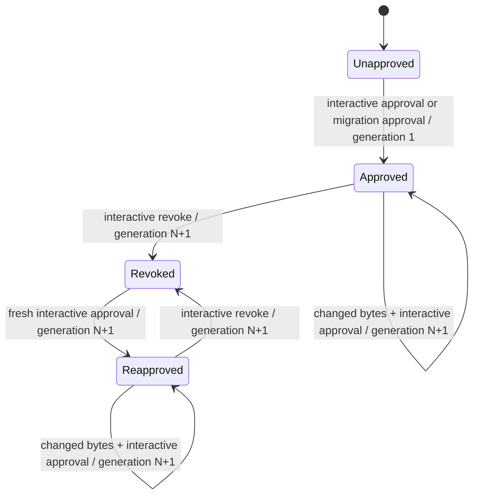
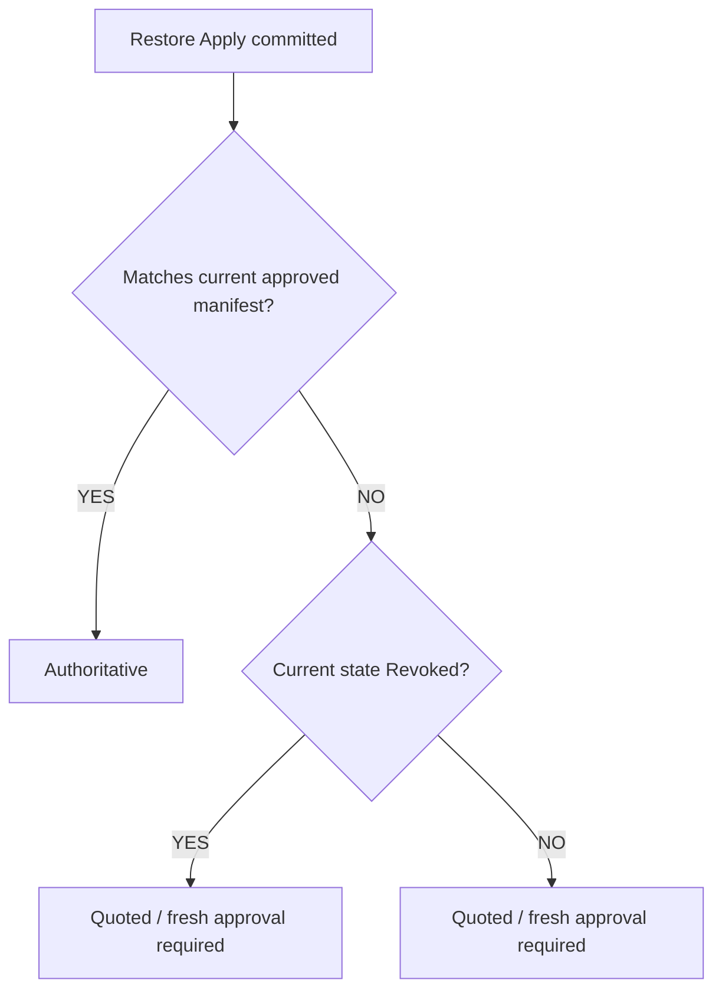

# SEC-05 Phase 4C — Authority Retirement, Revocation, and Restore

Status: complete security specification for user review; implementation has not
started.

Base: `d2992c3` (`origin/main` when this specification was written).

## 1. Scope

Phase 4C SHALL:

1. permanently retire format-1 authority;
2. make revocation a first-class authenticated format-2 generation;
3. require fresh per-slot interactive approval during legacy migration;
4. stage recalled content outside the project and outside the trust store;
5. define the only supported operation that may apply a staged restore candidate
   to a source slot; and
6. preserve one append-only authenticated format-2 state machine for approval,
   migration approval, revocation, and reapproval.

Phase 4C SHALL NOT create a second authority database.

This specification covers the format-2 authority slots `master-prompt`,
`instructions`, and `baseline`. A legacy record for any other slot, including
`followups`, SHALL be reported by migration as unsupported and SHALL remain
non-authoritative. Restore MAY stage and apply non-authority project artifacts,
but such artifacts SHALL have no automatic-authority branch and SHALL always be
treated as untrusted data.

Owner-selected logical project labels, summary provenance, replay/freshness for
semantic retrieval, OS-mediated human-presence proof, and the Phase 4B review
carryovers concerning BOM display, duplicated lock readers, unusable journal
upload, and large approval views are deferred. They SHALL NOT be introduced
incidentally by Phase 4C.

## 2. Normative language

The key words **MUST**, **MUST NOT**, **SHALL**, **SHALL NOT**, **SHOULD**, and
**MAY** are normative.

“Fail closed” means the operation returns no authority, performs no project-file
replacement, performs no fallback to legacy trust, and emits a bounded
diagnostic that contains no untrusted file bytes.

## 3. Trust boundaries

Phase 4C has four distinct domains:

| Domain | Contents | Security meaning |
| --- | --- | --- |
| Project tree | Source slots and other project files | Repository-controlled; never authenticates trust |
| Format-2 trust store | Binding, manifest, immutable generations, audit events, transaction journals, locks | Owner-only authority state |
| Restore staging store | Candidate payloads, candidate envelopes, apply journals, consumption receipts | Owner-only transport state; never authority |
| Remote memory | Recalled payloads and remote metadata | Untrusted input |

The format-2 trust store and restore staging store MUST have disjoint roots and
disjoint authenticated record types. A valid restore-stage MAC MUST NOT verify
as a trust-record MAC, manifest MAC, audit-event MAC, binding MAC, or transaction
journal MAC.

Owner-only placement authenticates who may mutate local state; it does not make
recalled content authoritative. A staged candidate MUST retain
`origin=remote-recall` and `trust=untrusted` semantics regardless of its local
permissions or MAC.

## 4. Security invariants

### 4.1 Irreversible format-1 retirement

1. A Phase 4C authority decision MUST NOT consult format-1 records.
2. Format-1 MUST be non-authoritative before, during, and after migration.
3. No binding absence, manifest absence, manifest deletion, record deletion,
   corruption, read failure, recovery outcome, unsupported schema, or exception
   MAY select format-1 authority.
4. Removing all format-2 state MUST result in no authority.
5. Migration MAY read format-1 state only to inventory legacy slots and explain
   migration eligibility. That read MUST NOT participate in the authority
   decision.
6. Legacy retirement MUST NOT depend on a deletable per-project marker,
   environment value, config value, timestamp, or successful migration command.
7. Reinstall, restart, downgrade-resistant recovery within the Phase 4C binary,
   and partial migration MUST preserve the rule that format-1 is ignored.

Format-1 files MAY remain on disk for diagnosis or later explicit archival.
Their presence is inert.

### 4.2 Append-only authority

1. Approval, migration approval, revocation, and reapproval MUST use the same
   format-2 binding, per-slot lock, transaction journal, immutable generation
   records, audit chain, manifest commit, MAC construction, and recovery rules.
2. A state transition from generation `N` MUST create generation `N+1`.
3. A transition MUST NOT edit, replace, or delete any prior generation or audit
   event.
4. The manifest MAY advance only after the new immutable generation and audit
   event are durably present and authenticated.
5. An operation that leaves the slot in the same semantic state is not a state
   transition and MUST NOT mint a generation.
6. Concurrent contenders MUST NOT mint the same generation. The loser MUST
   re-read current state and either retry from the new `N` or fail closed.

### 4.3 Revocation is authenticated state

1. Revocation MUST be represented by an immutable authenticated tombstone
   generation, not by deletion.
2. A tombstone MUST bind the project identity, owner scope, slot, generation,
   prior generation, prior current record identity and hash, transition type
   `revoked`, key identity, and audit event identity.
3. The current manifest MUST state `revoked` and reference the tombstone.
4. A revoked manifest MUST make every byte string non-authoritative, including
   bytes approved by any prior generation.
5. Repeating revocation against an already-revoked current manifest MUST be an
   idempotent “already revoked” result and MUST NOT create another generation.
6. Revoking a slot with no authenticated approved current generation MUST fail
   closed and MUST NOT create a tombstone.

### 4.4 Restore staging never authorizes

1. Restore staging MUST be owner-local, owner-only, out-of-tree, and outside the
   format-2 trust root.
2. A staged candidate, candidate envelope, apply journal, or receipt MUST NOT be
   accepted by the authority decision.
3. Remote generation, provenance, author, timestamp, type label, ranking, blob
   identifier, or “latest” assertion MUST NOT influence authority.
4. Authority after apply MUST be computed afresh from the current authenticated
   format-2 manifest and the exact slot bytes produced by the shared slot-source
   resolver.

### 4.5 Current-manifest authority only

The current authenticated format-2 manifest is the sole selector of authority.
The current manifest MUST reference an authenticated current generation whose
state is `approved`. The approved generation MUST match the live project
identity, owner scope, slot, key identity, normalizer identity, exact raw hash,
and normalized content hash.

Historical records MAY be traversed to verify structural and MAC integrity.
History MUST NOT select which generation is current. If required history is
malformed or unverifiable, authority MUST fail closed.

Only byte-identical slot content matching the current approved generation MAY
automatically regain authority after restore apply. Content matching a
historical approval, a revoked approval, an unknown record, a remote claim, or
no record MUST remain quoted until a fresh interactive approval creates the
next generation.

## 5. Authenticated format-2 state machine



For the sequence “approved at `N`, revoked, reapproved,” the tombstone SHALL be
generation `N+1` and reapproval SHALL be generation `N+2`.

The current state SHALL be one of:

- `unapproved`: no valid format-2 manifest exists;
- `approved`: the valid current manifest references an approved generation;
- `revoked`: the valid current manifest references a tombstone; or
- `invalid`: state exists but cannot be fully authenticated or validated.

`unapproved`, `revoked`, and `invalid` SHALL all return
`authoritative=false`. `invalid` MUST NOT be treated as `unapproved` for any
mutation or fallback decision.

## 6. Migration

The command SHALL be:

```text
noosphere trust migrate
```

Migration MUST:

1. inventory every supported legacy slot without using legacy data as authority;
2. classify each slot as `eligible`, `absent`, `invalid`, `unsupported`,
   `already-migrated`, or `revoked`;
3. require the normal interactive approval ceremony independently for each
   `eligible` slot;
4. display and bind the exact current slot bytes through the shared slot-source
   resolver;
5. create a normal format-2 approved generation with a source transition label
   indicating migration approval;
6. leave invalid, absent, unsupported, declined, and skipped slots untrusted;
7. preserve a current revoked state without prompting to migrate an older
   approval over it;
8. be resumable by deriving progress solely from authenticated current format-2
   state; and
9. be idempotent.

Migration MUST NOT bulk-approve slots, accept one confirmation for multiple
slots, import a legacy MAC as a format-2 MAC, copy a legacy generation number,
or silently translate a legacy record.

If migration is interrupted after one slot commits and before another begins,
the committed slot SHALL remain approved and all uncommitted slots SHALL remain
untrusted. A later invocation SHALL report the committed slot as
`already-migrated` and continue with the remaining inventory.

If the current format-2 state is revoked, missing, malformed, locked,
ambiguous, or changes during confirmation, migration MUST NOT use any legacy
record to supersede it.

## 7. Revocation and reapproval

The revocation command SHALL be:

```text
noosphere trust revoke <slot>
```

Revocation MUST:

1. accept only a supported format-2 authority slot;
2. require both stdin and stdout to be interactive terminals;
3. show the project identity, slot, current generation, current record identity,
   raw hash, and normalized content hash in a terminal-safe view;
4. require an exact, bounded, case-sensitive typed confirmation that binds the
   action, slot, generation, and current record hash;
5. acquire the same per-slot lock used by approval and migration;
6. re-read and authenticate current state after confirmation;
7. fail closed if any confirmed value changed;
8. commit an authenticated tombstone at `N+1`;
9. append a complete audit event; and
10. leave all earlier records and events unchanged.

Reapproval after revocation SHALL use the ordinary approval command and
ceremony. It MUST create a new approved generation after the tombstone. It MUST
NOT overwrite, reinterpret, or remove the tombstone.

## 8. Restore staging

The supported commands SHALL be:

```text
noosphere restore
noosphere restore list
noosphere restore show <candidate-id>
noosphere restore apply <candidate-id>
```

`noosphere restore` MAY be an alias for a named staging operation. It MUST stage
remote results and MUST NOT modify source slots.

Each active candidate MUST contain:

- an opaque locally minted candidate ID;
- the bound project identity;
- the destination slot;
- the exact proposed destination payload;
- the SHA-256 hash and byte length of that payload;
- the exact derived slot bytes produced for authority comparison;
- the raw and normalized hashes of those derived bytes when the slot is
  authority-capable;
- bounded remote metadata labeled untrusted;
- an explicit `untrusted` trust label;
- its creation time for retention only; and
- an authenticated candidate envelope using a restore-specific MAC domain.

Candidate time and remote metadata MUST NOT participate in authority.

Candidate payloads and metadata MUST:

- be regular files;
- be read with the shared bounded safe-read primitive;
- reject symlinks without following them;
- reject FIFOs, sockets, devices, and directories;
- enforce fixed non-configurable size bounds before allocation and before
  terminal rendering;
- use fatal UTF-8 decoding for text slots; and
- fail closed on missing, unreadable, non-canonical, malformed, or changed
  content.

The fixed limits SHALL be:

- authority-capable candidate payload: 1,048,576 bytes;
- other project-artifact candidate payload: 8,388,608 bytes;
- candidate envelope, apply journal, or consumption receipt: 65,536 bytes each;
  and
- typed confirmation input: 256 bytes.

The limits MUST NOT be configurable through CLI flags, environment, project
config, remote metadata, or candidate metadata.

`restore list` MUST emit bounded metadata and MUST NOT emit candidate payloads.
`restore show` MUST display a bounded terminal-safe byte representation and the
normalized quoted rendering. Neither command may mutate project files, authority
state, candidate consumption state, or receipts.

## 9. Restore apply confirmation context

`restore apply` MUST require both stdin and stdout to be interactive terminals.
Before prompting, it MUST create one authenticated, single-use confirmation
context that binds all of the following as one indivisible object:

- candidate payload hash;
- destination raw hash, or an explicit authenticated absence marker;
- slot;
- project identity;
- restore candidate ID; and
- current manifest generation, or an explicit authenticated no-manifest marker.

The context MUST additionally bind the current manifest state (`approved`,
`revoked`, or `unapproved`) and the machine-key identity. These fields MUST NOT
weaken or replace any required field above. Invalid or ambiguous format-2 state
MUST be refused before a confirmation context is created.

The confirmation context MUST have one canonical serialized form and one
restore-confirmation-domain MAC. Its single-use state MUST be owner-only and
MUST be consumed before the destination mutation begins. A consumed context
MUST NOT be recoverable as live confirmation state.

The prompt MUST show the complete confirmation context in bounded,
terminal-safe form and require an exact, case-sensitive typed phrase derived
from that context. Whitespace trimming, normalization, prefix acceptance,
suffix acceptance, wildcard confirmation, and confirmation reuse are forbidden.

A confirmation for one candidate, destination version, slot, project identity,
or manifest generation MUST NOT authorize any other context.

## 10. Final state barrier

Immediately before any temporary destination file is created, restore apply
MUST, under the per-slot lock, re-read and re-authenticate as one barrier:

- the candidate payload and envelope;
- the destination and its exact hash or absence;
- the current manifest and state;
- the project binding and identity; and
- the current generation.

Every value MUST equal the authenticated confirmation context. Any mismatch,
absence where presence was confirmed, presence where absence was confirmed,
state change, lock loss, read ambiguity, or validation failure MUST fail closed.

The checks above SHALL be treated as one state observation. Passing a subset
MUST confer no permission to write.

## 11. Destination write contract

After the final state barrier succeeds:

1. the destination path MUST be the fixed allowlisted path for the confirmed
   slot;
2. an existing destination MUST be a regular file;
3. the destination and every project-relative parent MUST be checked with
   no-follow semantics;
4. symlink, FIFO, socket, device, directory, permission ambiguity, and path
   containment failure MUST be refused;
5. source and destination sizes MUST be bounded;
6. the candidate payload MUST be written to an exclusive sibling temporary file
   using the safe open primitive;
7. the temporary file MUST be flushed before replacement;
8. replacement MUST be atomic;
9. required parent-directory durability MUST be attempted under the existing
   platform durability contract;
10. Windows destination contention MUST remain bounded and MUST never downgrade
    to truncate-in-place; and
11. a failed replacement MUST preserve the prior destination and clean or
    recover the temporary file.

Apply MUST NOT write into the format-2 trust store. Restore-specific transaction
state and consumption records MUST remain in the disjoint restore staging store.
Applying bytes is not approval.

After replacement, authority MUST be recomputed from the current authenticated
manifest and live derived slot bytes:



## 12. Restore apply transaction and crash recovery

Restore apply MUST use an authenticated journal under the same candidate and
slot lock domain. Journal states SHALL be monotonic:

```text
confirmed
temporary-written
destination-replaced
receipt-committed
candidate-consumed
```

Each journal state MUST bind the candidate ID, complete confirmation context,
previous journal state, payload hash, expected destination hash, resulting
destination hash, project identity, slot, manifest generation, and unique
transaction ID.

Recovery MUST authenticate every journal, referenced candidate, temporary file,
receipt, and consumed-candidate location before acting. Malformed, foreign,
hash-mismatched, missing-but-required, or contradictory state MUST be
quarantined or reported as ambiguous and MUST fail closed.

Crash outcomes SHALL be:

| Crash window | Required recovery |
| --- | --- |
| Before `confirmed` is durable | No write occurred; candidate remains staged; a new apply requires a new confirmation |
| After `confirmed`, before temporary write | Remove or close the inert journal; candidate remains staged; require new confirmation |
| After temporary write, before rename | Verify and remove the temporary file; destination remains unchanged; require new confirmation |
| After rename, before `destination-replaced` journal update | If and only if the destination exactly equals the confirmed resulting hash and the authenticated journal proves the pending transaction, record `destination-replaced`; MUST NOT rename again |
| After rename, before receipt | Commit the authenticated receipt and consume the candidate; MUST NOT replace the destination again |
| After receipt, before candidate consumption | Refuse apply because the receipt already exists; finish candidate consumption only |
| After candidate consumption | Clean authenticated completed journal state only; MUST NOT touch the destination |

Recovery MUST be idempotent. Repeating recovery any number of times MUST produce
the same terminal result. Recovery MUST never repeat a destructive destination
replacement.

If the destination changed after a committed rename but before recovery, recovery
MUST NOT restore the candidate again. It MUST preserve the newer destination,
mark the transaction ambiguous, and require owner intervention.

## 13. Candidate consumption and replay

Restore candidates are single-use.

Successful apply MUST:

1. create an immutable authenticated consumption receipt bound to the complete
   confirmation context, transaction ID, candidate payload hash, post-write
   destination hash, and resulting authority classification;
2. atomically remove the candidate from the active namespace by moving it to a
   consumed namespace or by deleting it only after the receipt is durable; and
3. make every later apply of that candidate ID fail as `consumed`.

Consumption MUST be checked in both the active-candidate namespace and the
consumed namespace. Deleting a receipt alone MUST NOT make a candidate active:
the candidate remains absent from the active namespace or present in the
consumed namespace and SHALL be refused.

A missing receipt combined with a consumed candidate is recoverable completed
state, not a staged candidate. Reintroducing an old payload under a newly minted
candidate ID is a new untrusted candidate and still requires a new complete
confirmation; it gains no authority from the prior receipt.

## 14. Concurrency and lock domains

The serialization key SHALL be `(project identity, slot)`.

The following operations MUST acquire the same exclusive per-slot lock before
their final authenticated state read and MUST hold it through durable commit:

- approve;
- revoke;
- each per-slot migration approval; and
- restore apply.

Restore staging and read-only `restore list/show` MAY run without the slot lock,
but candidate creation MUST use an exclusive candidate-ID creation primitive.

Lock records MUST be owner-only and authenticated. Malformed, foreign,
unreadable, live, or ambiguously stale locks MUST fail closed. Recovery MUST NOT
automatically reclaim a lock solely because of age.

No operation MAY hold two slot locks while waiting for interactive input.
Interactive confirmation MUST occur before final lock acquisition, followed by
the final state barrier under the lock. A state change between confirmation and
lock acquisition MUST fail closed.

## 15. Threat model

The repository attacker may write arbitrary project-tree content. The remote
attacker may control recalled payloads and all remote metadata. A local
same-user or administrator who can freely rewrite both owner-only trust and
restore roots remains outside the SEC-03 attacker model.

| Attack | Capability | Required defence | Accepted residual |
| --- | --- | --- | --- |
| Format-2 deletion | Delete a binding, manifest, record, or all format-2 project state | Authority returns false; format-1 is never consulted; migration and restore do not infer approval | A same-user attacker may cause denial of authority |
| Stale restore replay | Replay bytes or remote metadata from an older approval | Remote generation is ignored; only the current local approved manifest may restore authority | Owner may explicitly apply stale bytes as quoted data and freshly approve them |
| Restore tampering | Modify staged payload or metadata | Owner-only storage, restore-domain MAC, exact hash, safe read, confirmation binding, final barrier | Same-user compromise of the complete staging root is out of scope but still cannot mint authority |
| Destination replacement | Change the source slot after confirmation | Destination hash is inside the single confirmation context and is re-read at the final barrier | Same-user change after atomic commit is equivalent to ordinary source editing and invalidates authority |
| Symlink destination | Replace slot or parent with a symlink | No-follow parent and destination checks; refuse replacement | Same-user parent-swap TOCTOU residual remains as documented for Node path APIs |
| FIFO destination | Plant a FIFO | Regular-file classification before open; bounded safe primitive; refuse | None |
| Device/socket destination | Plant a device or socket | Regular-file classification; refuse | None |
| Oversized input | Supply sparse or large candidate/destination | Fixed pre-allocation and read bounds; refuse | Legitimate oversized data requires external manual handling and remains untrusted |
| Generation race | Approve, revoke, migrate, or apply concurrently | One slot lock, final barrier, manifest compare-and-set, generation `N+1` | Contender may receive a retryable refusal |
| Project identity replacement | Replace binding between confirmation and write | Identity is inside the confirmation context and re-authenticated at barrier | Same-user denial of service |
| Crash replay | Crash at any apply phase and invoke recovery repeatedly | Authenticated monotonic journal; recovery never repeats replacement | Ambiguous externally modified destination requires owner intervention |
| Consumed restore replay | Delete receipt or invoke apply twice | Candidate removed from active namespace; consumed namespace and receipt both gate apply | Same-user recreation under a new ID is a new explicit apply, never authority |
| Remote provenance spoofing | Claim owner origin, current generation, latest timestamp, trusted type, or valid record ID | All remote metadata remains untrusted and is excluded from authority | Spoofed labels may be displayed only as bounded quoted metadata |
| Revocation rollback | Present older approved bytes or history after tombstone | Current revoked manifest makes all bytes untrusted; reapproval must mint next generation | Wholesale owner-store rollback by same-user remains the previously accepted residual |
| PTY automation | Allocate a pseudo-terminal and type the required phrase | TTY prevents ordinary unattended/piped use; exact context limits confused-deputy reuse | TTY is not OS-mediated proof of human presence; existing accepted residual remains |

## 16. CLI authority boundary

Approval, revocation, migration approval, and restore apply MUST be reachable
only through their explicit interactive CLI ceremonies.

There MUST be no:

- `--yes`, `--force-approve`, unattended, batch-confirmation, or equivalent flag;
- environment variable that confirms or bypasses confirmation;
- config value that confirms or bypasses confirmation;
- API route;
- MCP tool or resource;
- hook-triggered mutation;
- restore-triggered approval;
- package export for a writer; or
- natural-language/model-output inference of owner intent.

Both stdin and stdout MUST be TTYs. Piped stdin, redirected stdout, EOF,
interrupt, overlong input, partial phrase, normalized phrase, wrong case, or
additional bytes MUST refuse without mutating authority or project files.

The known PTY-relay residual MUST remain disclosed: an attacker already able to
run commands as the owner can allocate a PTY and drive it. Phase 4C does not
claim human presence.

## 17. Package boundary

Migration, revocation, restore apply, restore transaction recovery, consumption
writers, and approval writers MUST remain internal to the continuity CLI
package.

Phase 4C MUST add no package export. The supported trust-store export MAY expose
only read-only authority classification already required by consumers. Deep
imports of internal writers MUST remain blocked by the export map and excluded
from documented public interfaces.

MCP server code, generated adapters, hooks, lifecycle services, relayer code,
and other packages MUST NOT import or invoke an authority or restore writer.

## 18. Failure semantics

All security-boundary parse, read, lock, MAC, schema, identity, generation,
canonicalization, hash, size, type, containment, durability, recovery, and
confirmation failures MUST fail closed.

An existing-but-unusable object MUST NOT be classified as absent. Error
diagnostics MUST name a bounded failure class and path but MUST NOT print
untrusted bytes.

A mutation operation MUST return success only after its authoritative manifest,
project destination, receipt, or other promised durable terminal state has been
re-read and verified as applicable.

## 19. Verification requirements

Tests MUST be red before the corresponding behavior exists and MUST exercise
production paths rather than a reimplementation.

### 19.1 Format retirement and migration

Tests SHALL prove:

- valid format-1 bytes are non-authoritative under Phase 4C;
- deleting a format-2 manifest cannot reactivate format-1;
- deleting a format-2 binding cannot reactivate format-1;
- corrupt and unreadable format-2 state cannot reactivate format-1;
- each eligible slot requires a distinct real-PTY approval;
- skipped, invalid, absent, declined, and unsupported legacy slots stay
  untrusted;
- interruption after one migrated slot resumes without reapproving it;
- repeated migration is idempotent; and
- migration never supersedes a current tombstone.

### 19.2 Revocation and reapproval

Tests SHALL prove:

- approval at `N`, revocation at `N+1`, and reapproval at `N+2`;
- tombstones use the same lock, journal, MAC, audit, and recovery path;
- old approved bytes are non-authoritative after revocation;
- repeated revocation creates no generation;
- revocation never deletes prior records or events;
- changed state after confirmation refuses; and
- non-interactive revocation mutates nothing.

### 19.3 Restore staging and apply

Tests SHALL prove:

- restore staging does not modify source slots;
- staged content never authorizes itself;
- stale restore remains quoted;
- current byte-identical restore regains authority;
- historical, revoked, unknown, and normalized-equal/raw-different content stays
  quoted;
- replayed remote generation and provenance are ignored;
- candidate tampering refuses;
- destination change after confirmation refuses;
- identity change after confirmation refuses;
- generation or manifest-state change after confirmation refuses;
- confirmation fields are one authenticated object and cannot be mixed between
  candidates;
- consumed candidate replay refuses even if its receipt is deleted;
- symlink, FIFO, socket, device, directory, invalid UTF-8, and oversized
  candidate/destination inputs refuse without blocking;
- replacement is atomic and durable under the existing platform contract; and
- no failed apply leaves an untracked temporary file.

### 19.4 Crash and concurrency

Real process-death tests SHALL kill the writer at every journal state:

- before write;
- after temporary write;
- after rename;
- before receipt;
- after receipt; and
- after candidate consumption.

Tests SHALL prove repeated recovery is idempotent and never repeats destination
replacement.

Concurrency tests SHALL race every pair of approve, revoke, migration approval,
and restore apply against the same slot. Exactly one transition MAY commit from
one observed generation. No pair may reuse a generation, bypass a tombstone,
apply against a stale destination, or lose an audit event.

### 19.5 Boundary verification

Tests SHALL prove:

- no `--yes`, environment, config, API, MCP, hook, or non-TTY bypass exists;
- real PTY success and piped/redirected failure;
- no new package export;
- deep imports of internal writers fail;
- the packed package exposes no test harness or writer entry point;
- MCP, adapters, hooks, lifecycle, and relayer code contain no writer import;
  and
- documentation does not claim the TTY proves human presence.

### 19.6 Platforms and merge gate

The mandatory suite MUST run on Linux, macOS, and Windows. Platform-native tests
MUST cover POSIX file type/no-follow behavior, macOS filesystem behavior, and
Windows reparse points, DACL preservation, sharing contention, and durable
replace semantics.

Phase 4C SHALL NOT merge unless:

1. focused SEC-05 tests pass;
2. the complete MCP and secure-filesystem suites pass;
3. all three platform jobs pass;
4. exact-head package-boundary checks pass;
5. crash and concurrency tests pass without retries masking a failure; and
6. an independent hostile review finds no unresolved authority or destructive
   restore defect.

## 20. Security outcome

After Phase 4C, format-1 records are inert historical data. The only authority
state is the current authenticated format-2 manifest. Revocation is durable,
audited, and append-only. Recalled bytes can enter the project only through
owner-local staging, one authenticated confirmation context, a final state
barrier, and an atomic durable replacement. Restore never approves content, and
only exact bytes matching the current approved generation can automatically
regain authority.
